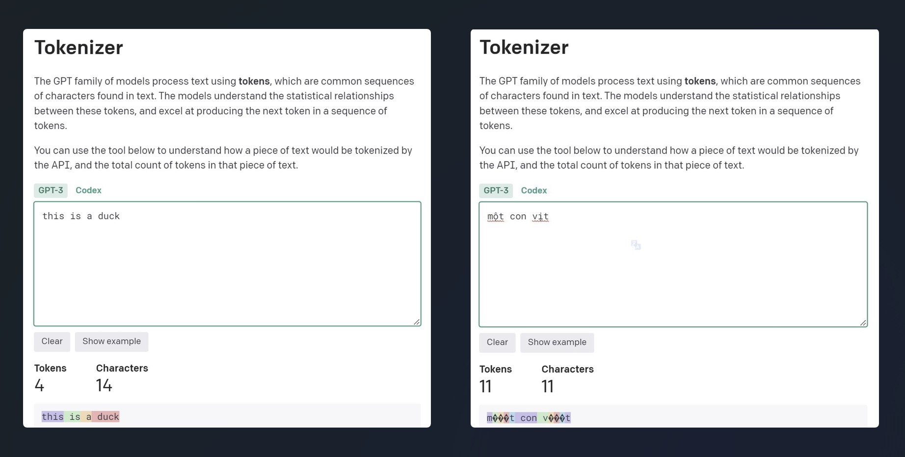
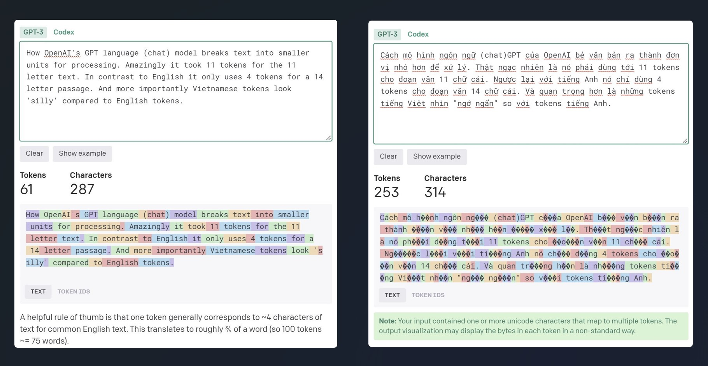
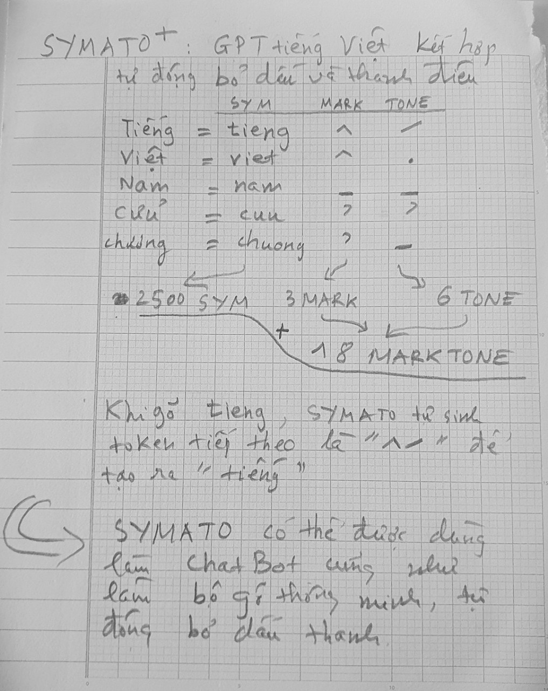
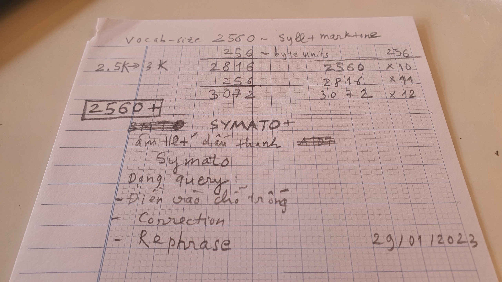
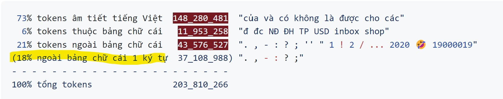
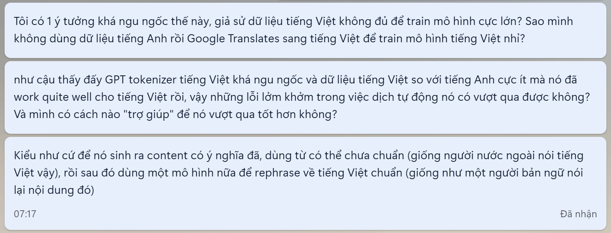

TODOs

- [x] Tìm cách tokenization hợp với tiếng việt => xem [symato](#symato)
- [x] Đọc hiểu RWKV => [xem rwkv.md](./docs/rwkv.md)
- [ ] Viết lại RWKV inference engine
- [ ] Đọc hiểu và thử tối ưu WKV-Cuda
- [ ] RWKV vs NanoGPT với âm tiết tiếng Việt

- - -

Thiết lập các thử nghiệm theo mô hình ngôn ngữ [RWKV](./docs/rwkv.md) với bộ dữ liệu càng thuần Việt càng tốt, tập trung vào âm tiết tiếng Việt, mục đích là để làm nhẹ bộ tham số và làm nổi bật đặc trưng của tiếng Việt. Và trả lời các câu hỏi dưới đây:

- Liệu có thể lặp lại scaling law chỉ với một lượng dữ liệu và tính toán hạn chế? (xem cramming paper)

- Liệu có thể lặp lại scaling law chỉ với một tác vụ nhỏ trong xử lý ngôn ngữ? (xem santacoder)

- Các cách khác nhau để khai thác mô hình mà chưa cần fine-tune?

- Các cách khác nhau để tăng độ hiệu quả của một mô hình? (tiếp tục pre-train, fine-tune cho từng tác vụ, RLHL ...)

- Bao nhiêu lượng dữ liệu là đủ để pre-train tiếp một mô hình đang có cho một ngôn ngữ lạ?

- Liệu những gì nó học được từ ngôn ngữ này có thể "mang sang" ngôn ngữ khác không?

- Với một lượng dữ liệu nhất định, của một domain cụ thể thì nên tokenization như thế nào? Bao nhiêu params / training bao lâu là đủ?

- Làm sao để tăng khả năng sử dụng tối đa sức mạnh phần cứng đang có để huấn luyện mô hình?
  - FlashRWKV: tối ưu RWKV theo cách FlashAttention và FlashConv làm được cho Self-Attention và State Space Models (H3 paper)
  - AMP: Auto-Mixed Precision + BitsAndBytes quantization
  - Sử dụng [2:4 spare matrix](https://timdettmers.com/2023/01/16/which-gpu-for-deep-learning/#Sparse_Network_Training) (có thể coi đây là Dropout với p = 0.5)
  - Viết lại bằng C++/CUDA framework (tham khảo [tiny-cuda-nn](https://github.com/NVlabs/tiny-cuda-nn))

- - -

## Tại sao lại RWKV chứ không phải Transformer?
[RWKV](./docs/rwkv.md) là một mô hình rất thú vị, nó vừa mang tính chất của GPT tức là huấn luyện song song được như Transformer, vừa mang tính chất của RNN chỉ cần trạng thái ẩn ở bước t để tính toán trạng thái hệ thống ở bước t+1. Vì thế nó tiết kiệm tính toán, bộ nhớ hơn rất nhiều so với Transformer. Việc này giúp huấn luyện nhanh, triển khai dễ dàng, thậm chí chạy tốt trên smartphone. RWKV đã được huấn luyện từ 1B tới 14B params trên tập ngữ liệu The Pile và có độ tốt tương đương các mô hình transformer khác. Các lợi thế này có thể không có ích với các tập đoàn lớn như Google, Microsoft (cung cấp hệ thống cho OpenAI) bởi họ có dư sức mạnh tính toán và lượng dữ liệu khổng lồ. Nhưng với lượng tính toán có hạn (ví dụ một máy tính mạnh trang bị 8 GPUs) và lượng dữ liệu hạn chế như tiếng Việt thì RWKV có thể làm nên sự khác biệt.

## Tại sao cần pre-train cho riêng tiếng Việt?

Các mô hình ngôn ngữ lớn hiện nay bị thống trị bởi tiếng Anh và các ngôn ngữ gốc La-tinh, ngôn ngữ Việt do dữ liệu ít và đặc trưng riêng (các ký tự utf-8 mã hóa 2-4 bytes) nên khi tokenization sẽ trở nên lép vế (xem hình dưới). Từ đấy dẫn tới thiệt hại về cả hiệu suất và kinh tế (nhiều tokens / words thì sinh câu chậm hơn, tốn tài nguyên hơn)

Minh họa trên cho thấy cùng một đoạn văn có độ dài tương đương, số lượng tokens tiếng Việt nhiều gấp 4 lần tiếng Anh. Hệ quả là độ dài ngữ cảnh giảm đi 1/4, tốc độ sinh dữ liệu chậm đi 4 lần và nếu tính tiền theo token thì tiếng Việt cũng bị tính nhiều hơn 4 lần so với tiếng Anh.

Nguyên nhân là do bộ tokenization của chatgpt được tối ưu cho tiếng Anh và các ngôn ngữ La-tinh, vì thế nó không hiểu được nhiều mã unicode tiếng Việt (được encode bằng 2-4 bytes), cụ thể ký tự "ữ" trong "ngôn ngữ" bị tokenized thành 3 bytes (thể hiện bằng 3 dấu ??? ở minh họa trên). Tuy cách tokenize rất bất lợi cho tiếng Việt, cộng thêm lượng dữ liệu huấn luyện bị lép vế so với tiếng Anh nhưng kết quả chatgpt vẫn rất ấn tượng với tiếng Việt (video dưới).

https://user-images.githubusercontent.com/8133/215305323-4d776242-d8fe-497e-96f5-9c95f344b992.mp4

Video cho thấy tốc độ sinh dữ liệu cho tiếng Việt chậm hơn rất nhiều so với tiếng Anh do nó sinh từng ký tự một thậm chí từng byte một cho tiếng Việt. Còn với tiếng Anh nó chủ yếu sinh theo từ. Tuy bất lợi như vậy nhưng mô hình vẫn đủ mạnh mẽ để lưu trữ các thông tin tiếng Việt và tìm ra câu trả lời hợp lý. Điều đó cho thấy sức mạnh rất to lớn của mô hình ngôn ngữ, và chatgpt là ứng dụng đầu tiên đưa sức mạnh đó tới tay người dùng một cách dễ chịu. Hay nói cách khác chatgpt xây dựng được giao diện hợp lý để người dung khai thác sức mạnh của mô hình ngôn ngữ lớn. (Lưu ý: câu trả lời của chatGPT về âm tiết tiếng Việt là chưa chính xác hoàn toàn).

## Symato
Trả lời câu hỏi: Cách tokenization nào hợp với tiếng Việt?

Âm tiết tiếng Việt chiếm ~80% trong text corpus, nó chính là đặc trưng của cả tiếng nói và chữ viết Việt. Dùng âm tiết làm đơn vị là hợp lý. Tiếng Việt viết ~16K âm tiết có ý nghĩa, 12K âm tiết thường dùng, khi phân tách ra thành cách viết không dấu (sym) + dấu (mark) và thanh điệu (tone) thì số lượng đơn vị giảm đi đáng kể. Chỉ còn khoảng 2500 sym và 18 marktone. Như vậy với 2560 tokens là có thể cover hết được sym + marktone và còn thêm các token khác để biểu thị viết hoa vs viết thường, và các trường hợp khác.

Như vậy chỉ cần bộ vocab 2816 tokens (2560 tokens để encode thuần tiếng Việt + 256 tokens để encode 256 bytes để biểu diễn mọi thứ còn lại) là có thể tokenization hiệu quả mọi corpus có hàm lượng tiếng Việt lớn. Nhắc lại ví dụ trên khi chatgpt tokenize tiếng Việt dưới dạng chars và bytes để encode 80% corpus tiếng Việt mà vẫn cho ra kết quả ấn tượng, thì việc dùng 256 bytes để encode 20% phần còn lại chắc chắn sẽ hoạt động tốt.

### Tại sao không dùng bộ vocab lớn hơn?
Hoàn toàn có thể mở rộng vocabs lên nữa khi cần, nhưng việc giới hạn bộ vocabs nhỏ sẽ giúp tiết kiệm số lượng tham số và làm tăng tốc độ của mô hình. Và như giải thích ở trên, tôi tin rằng bộ vocab như vậy là đủ tốt cho những tài nguyên tiếng Việt hiện có.

[Thống kê gần 1Gb text](https://github.com/telexyz/results#readme) trộn từ facebook comments, news titles, viet opensub, wikipedia, sách, truyện được:

=> số lượng tokens không phải tiếng Việt và là 1 ký tự chiếm tới 18%, số tokens này dùng 256-bytes để encode là vô cùng hợp lý. Số lượng ít ỏi tokens không phải tiếng Việt còn lại dùng 256-bytes để encode cũng không ảnh hưởng nhiều tới hiệu năng mô hình.

## Others

