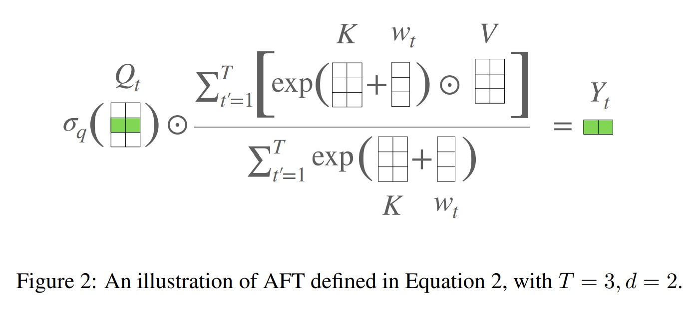
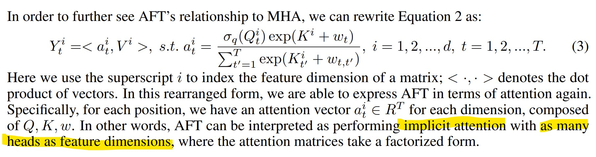
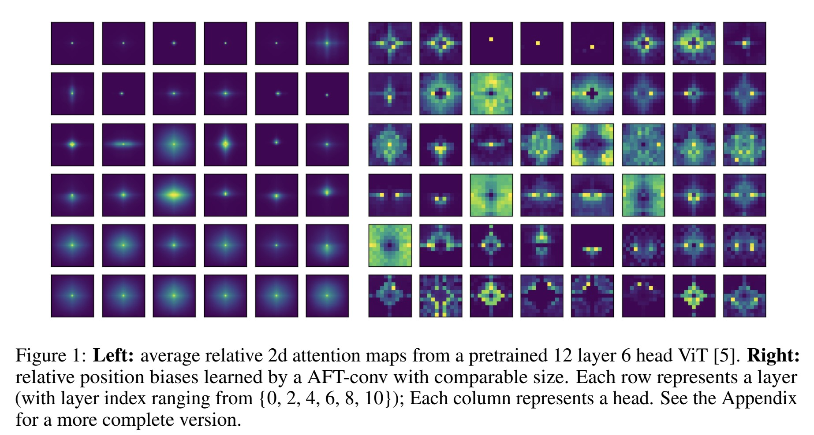

# An Attention-Free Transformer
https://arxiv.org/pdf/2105.14103.pdf

aft là một biến thể hiệu quả của tfm nhờ loại bỏ dot product self-attn. Trong tầng aft, key và value được kết hợp với một tập các position bias được học, kết quả sau đó được nhân với query element-wise. aft giữ được sự tương tác giữa 2 điểm bất kỳ trong context, đó cũng là thế mạnh của dot product attn.

Với mult-head attn, với mỗi head i `f_i(X) = sigma(Q_i K_i^T / sqrt(d_k)) V_i` với X thuộc R^{T * d}, Q_i, K_i, V_i = X W_i^QKV với 
W_i^QKV thuộc R^{d x (d_k + d_k + d_v)}, d_k và d_v là chiều của key và value. MHA ghép nối đầu ra của h attn heads dọc theo chiều của channel, và được kết quả là một vector đặc trưng có chiều `h d_v`. Ta có thể giả thiết d_k = d_v và h = d / d_k: có nghĩa là K,Q,V có cùng số chiều và chiều của đầu ra bằng chiều của đầu vào.

aft cũng chuyển hóa tuyến tính X thành Q,K,V = X W, và sau đó thực hiện: Y = f(X) với
`Y_t = sigma_q(Q_t) * sum_{t'=1}^T exp(w_t,t' + K_t') * V_t' / sum_{t'=1}^T exp(w_t,t' + K_t')` với:
- `*` là element-wise product.
- `sigma_q` là biến đổi phi tuyến tính sigmoid áp dụng vào Query.

__Giải thích bằng lời__: Với mỗi target position t, aft thực hiện một weighted avg of values, kết quả sau đó được kết hợp với query bằng element-wise multiplication. Cụ thể, weighting (trọng số) là một cách kết hợp đơn giản của keys và learned pair-wise position bias. Như vậy: `w_t,t'` là bias của từng cặp vị trí (ám chỉ t và t').

## Công thức chung là vậy (aft-full), giờ ta đi sâu vào các biến thể của aft

### aft-local

Trong nhiều ứng dụng locality (tính địa phương) là một inductive bias (thiên kiến quy nạp) đã được chỉ ra bởi CNNs và tfm. Chúng tôi nhận thấy rằng khi train ViT (một tfm tiêu chuẩn) có xu hướng thể hiện extensive local attn patterns.

Hình minh họa attn maps trên cho thấy strong local patterns (được thể hiện bởi hình dáng) đặc biệt là ở các tầng thấp. Điều này là động lực cho aft-local, khi mà chúng ta chỉ áp dụng a learned set of relative position bias locally:
`w_t,t' = w_t,t' với abs(t - t') < s còn lại bằng 0`, với s <= T là local window size. Khác với local tfm, aft-local vẫn giữ được các liên kết toàn cục bất kể kích cỡ cửa sổ s. Các thử nghiệm đã chứng minh tính hiệu quả của thiết kế này.