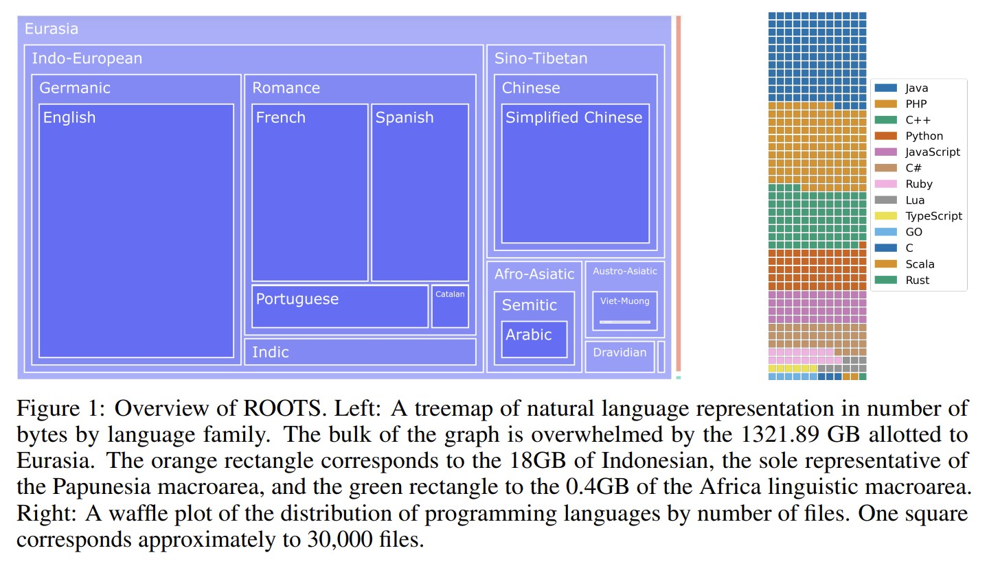
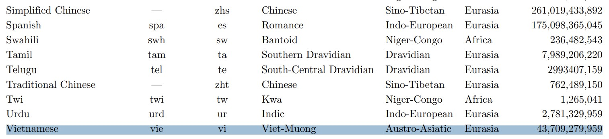
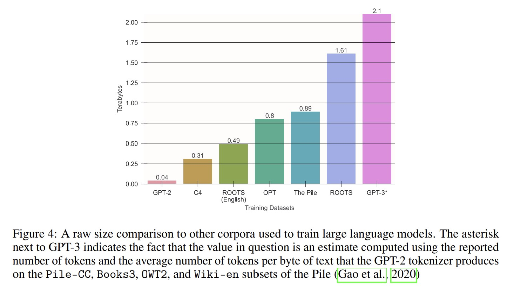
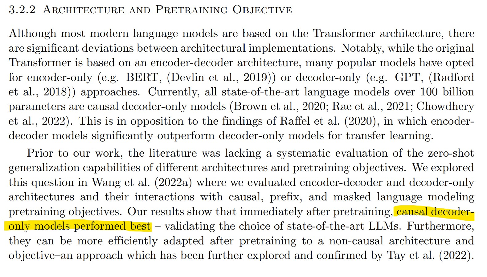
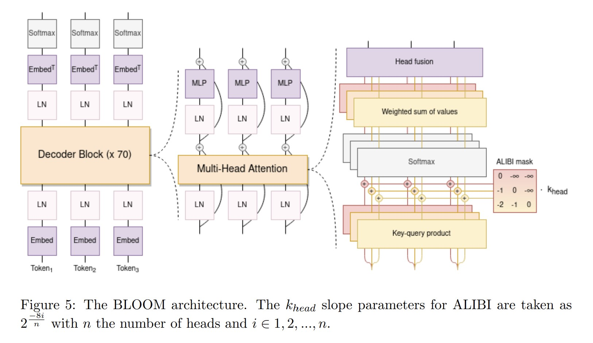
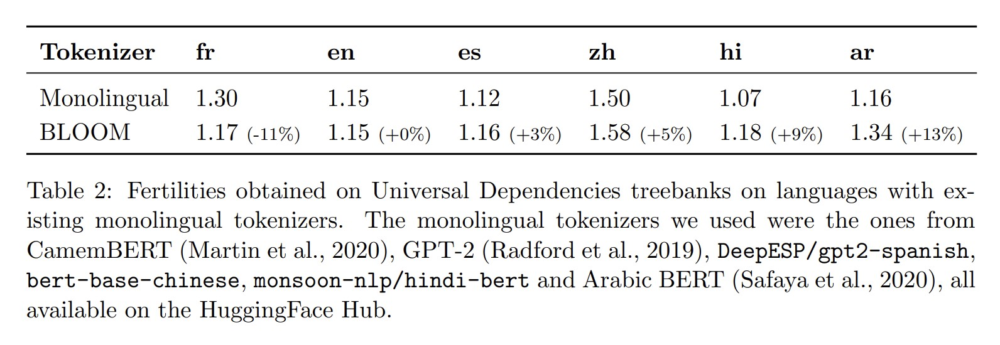
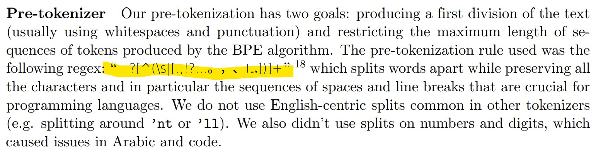
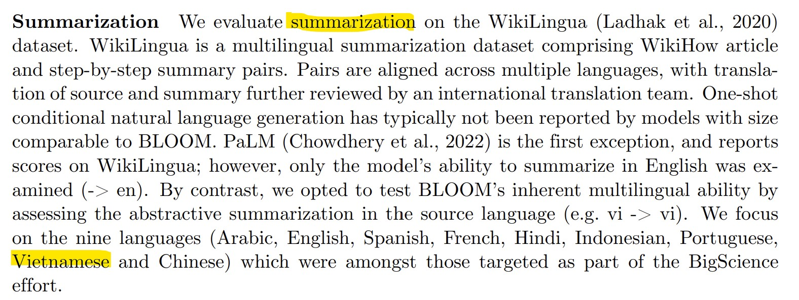
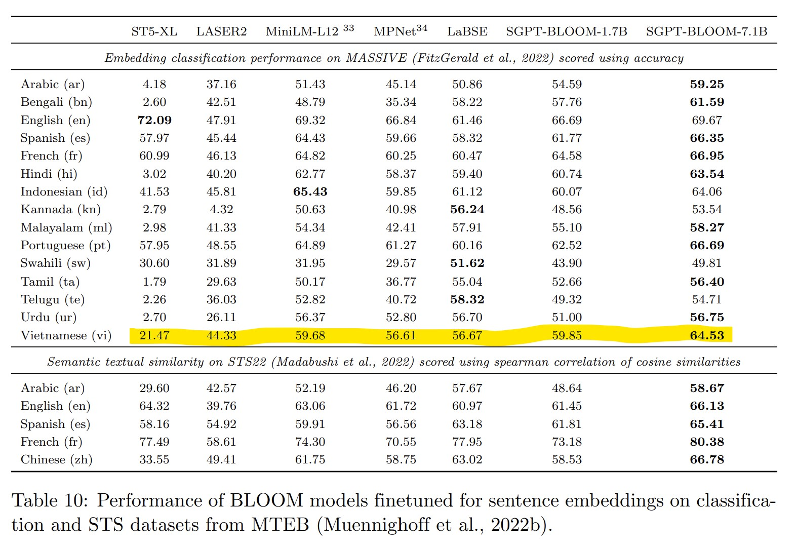

# ROOTS: 1.6TB Multilingual Dataset, 366B Tokens
https://openreview.net/pdf?id=UoEw6KigkUn

__=> Viet-Muong should be ~40Gb__ (=> 1/40 ~ 2.5%)

## 3.1 Data cleaning and filtering

- Too high character repetition or word repetition as a measure of repetitive content.
- Too high ratios of special characters to remove page code or crawling artifacts.
- Insufficient ratios of closed class words to filter out SEO pages.
- Too high ratios of flagged words to filter out pornographic spam. We asked contributors to tailor the word list in their language to this criterion (as opposed to generic terms related to sexuality) and to err on the side of high precision.
- Too high perplexity values to filter out non-natural language.
- Insufficient number of words, as LLM training requires extensive context sizes

# BLOOM: 176B-parameter decoder-only Transformer language model that was trained on the ROOTS corpus
https://arxiv.org/pdf/2211.05100.pdf

As a step towards democratizing this powerful technology, we present BLOOM, a 176B-parameter open-access language model designed and built thanks to a collaboration of hundreds of researchers. __BLOOM is a decoder-only Transformer language model that was trained on the ROOTS corpus__, a dataset comprising hundreds of sources in 46 natural and 13 programming languages (59 in total). We find that BLOOM achieves competitive performance on a wide variety of benchmarks, with stronger results after undergoing multitask prompted finetuning.

## Những đổi mới của BLOOM transformer
- __ALiBi Positional Embeddings__
- __Embedding LayerNorm__ In preliminary experiments training a 104B parameters model, we experimented with an additional layer normalization immediately after the embedding layer – as recommended by the `bitsandbytes` library (Dettmers et al., 2022) with its StableEmbedding layer. It is possible that bfloat16 alleviates the need for the embedding LayerNorm. We represent the full architecture of BLOOM in figure 5 for reference.

## Tokenization
The design decisions when training a tokenizer are often neglected in favour of “default” settings (Mielke et al., 2021). For instance, OPT (Zhang et al., 2022) and GPT-3 (Brown et al., 2020) both use GPT-2’s tokenizer, trained for English.

__Fertility__ (khả năng sinh sản) is defined as the number of subwords created per word or per dataset by the tokenizer, which we measured using subsets of Universal Dependencies 2.9 (Nivre et al., 2017) and OSCAR (Ortiz Suárez et al., 2019) in the languages of interest. A very high fertility on a language compared to a monolingual tokenizer may indicate a degradation on the downstream multilingual performance of the model (Rust et al., 2021). Our goal was to not degrade the fertility on each language by more than 10 percentage points when comparing our multilingual tokenizer with monolingual tokenizers in corresponding languages.

__Tokenizer Training Data__ We initially used a non-deduplicated subset of ROOTS. However, a qualitative study on the vocabulary of the tokenizer revealed issues in its training data. For instance, in earlier versions of the tokenizer, we found entire URLs stored as tokens caused by several documents containing a high number of duplicates. These issues motivated us to remove duplicated lines in the tokenizer training training data. We then applied the same sampling ratios per language as for the training data.

__Vocabulary Size__ A large vocabulary size reduces the risk of __over-segmenting some sentences, especially for low-resource languages__. We conducted validation experiments using 150k and 250k vocabulary sizes to make comparisons with existing multilingual modeling literature easier (Conneau et al., 2020; Xue et al., 2021). We ultimately settled for __a vocabulary of 250k tokens to reach our initial fertility objective compared to monolingual tokenizers__. Since the vocabulary size determines the embedding matrix size, it also had to be divisible by 128 for GPU efficiency reasons and by 4 to be able to use Tensor Parallelism. We used a final size of __250,680 vocabulary items with 200 tokens reserved for possible future applications__ such as removing private information using placeholder tokens.

__Byte-level BPE__ The tokenizer is a learned subword tokenizer trained using the Byte Pair Encoding (BPE) algorithm introduced by Gage (1994). In order not to lose information during tokenization, the tokenizer creates merges starting from bytes as the smallest units instead of characters (Radford et al., 2019). This way, tokenization never results in unknown tokens because all 256 bytes can be contained in the vocabulary of the tokenizer. In addition, __Byte-level BPE maximizes vocabulary sharing between languages__ (Wang et al., 2020).

__Normalization__ Upstream of the BPE tokenization algorithm, no normalization of the text was performed in order to have the most general model possible. In all cases, we observed that adding unicode normalization such as NFKC did not reduce the fertility by more than 0.8% on all the languages considered but came at the cost of making the model less general; for example, causing 2^2 and 22 to be encoded in the same way.

## Evaluation

