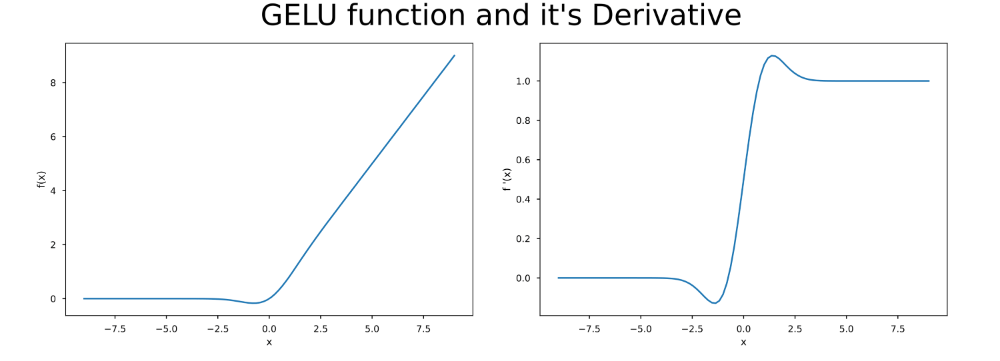
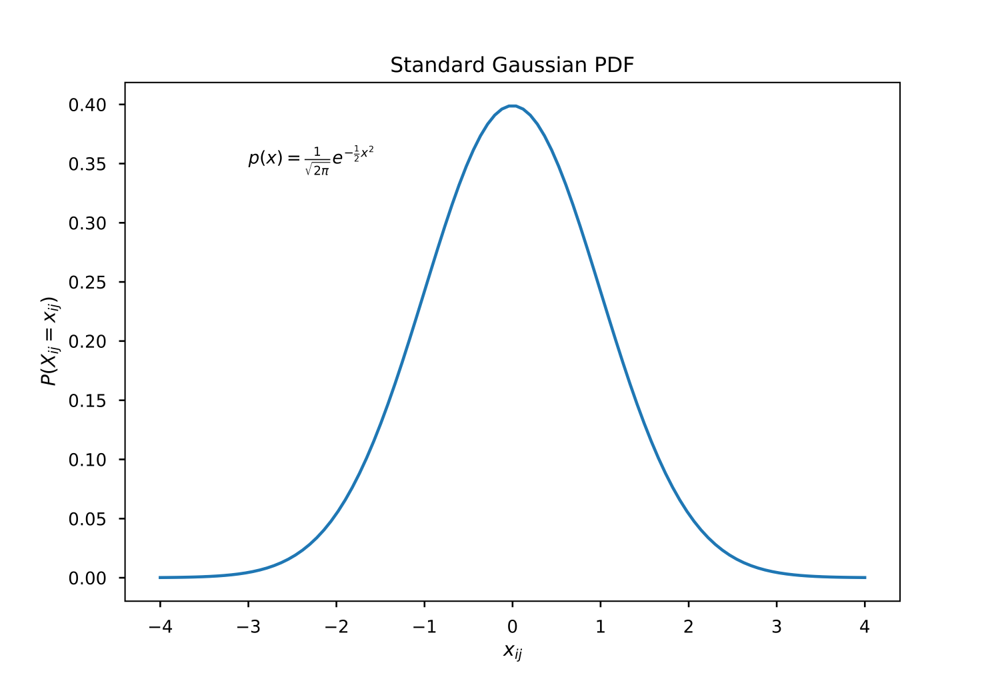
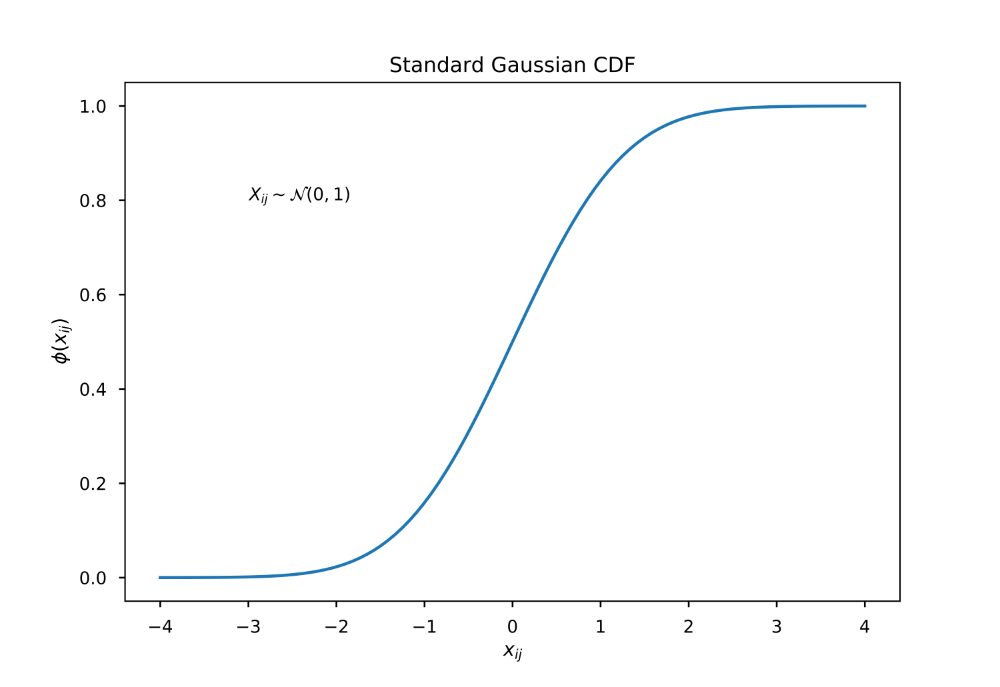
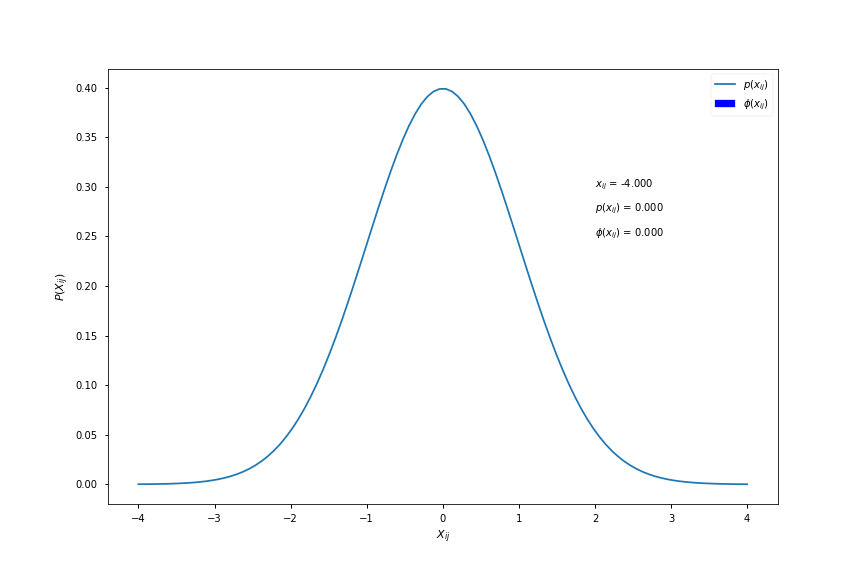
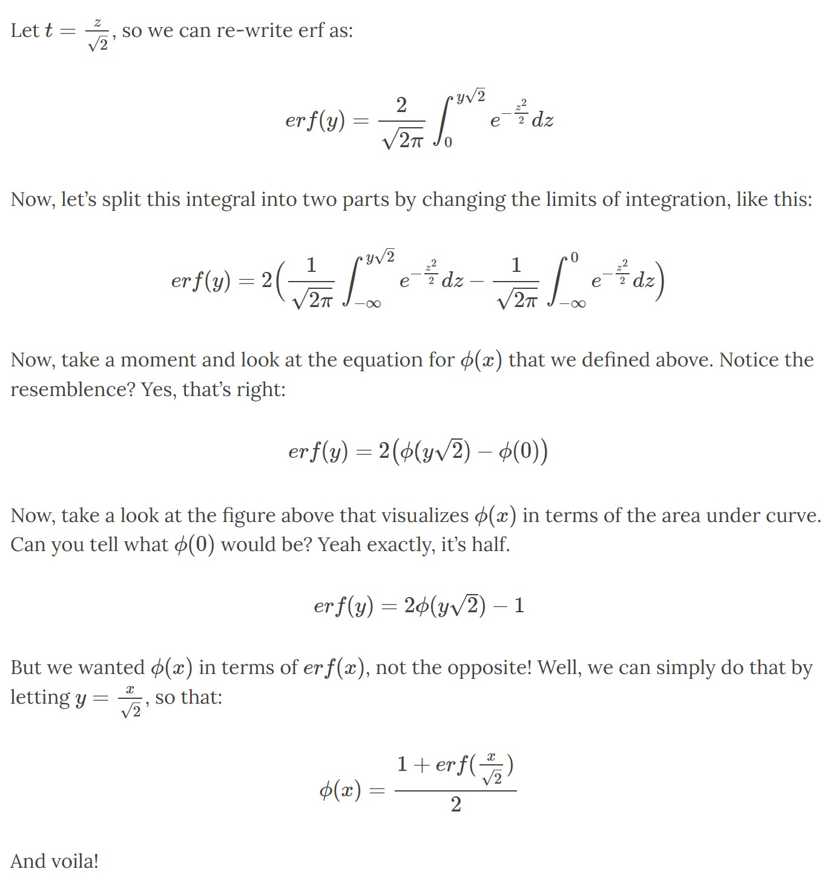
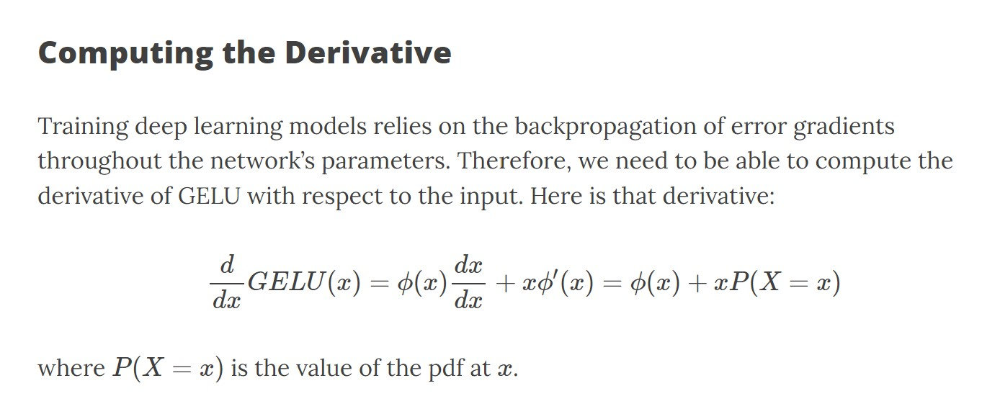

> hey chatgpt, i'm study deep learning in depth, can you tell me what gelu activation function is?

The GELU (Gaussian Error Linear Unit) activation function is a type of activation function that is often used in deep learning models, particularly for natural language processing tasks. It was first introduced in the paper "Gaussian Error Linear Units (GELUs)" by Dan Hendrycks and Kevin Gimpel in 2016.

The GELU function is defined as: `GELU(x) = x * ϕ(x)`

where x is the input to the function and ϕ(x) is the cumulative probability density function of a standard normal distribution.

GELU activation function has some properties that make it a good choice for deep learning models. It is a smooth, monotonic function that is easy to differentiate, which makes it well-suited for use in neural networks. It also has a self-normalizing property, which means that it tends to output values that are close to zero when the input is close to zero. This can help to prevent the problem of vanishing gradients in deep networks.

> can you explain it in more details? especially cumulative probability density function?

Sure, I'd be happy to explain the GELU activation function in more detail.

The cumulative probability density function (CDF) of a normal distribution, also known as the Gaussian cumulative distribution function, is a function that describes the probability that a random variable will take on a value less than or equal to a given value. The CDF of a standard normal distribution is defined as:
`ϕ(x) = (1/sqrt(2π)) ∫^x_-∞ e^(-t^2/2)dt`

Where x is the input variable and ϕ(x) is the cumulative probability density function.

The CDF is a useful function for describing the probability distribution of a random variable and is used in many areas of statistics, such as hypothesis testing and confidence intervals.

In the context of the GELU activation function, the CDF is used to smooth the input, this is done by multiplying the input by the CDF, which has the effect of transforming the input into a value that is close to zero when the input is close to zero. This helps to prevent the problem of vanishing gradients in deep networks, and also makes the function more robust to large input values.

The GELU activation function is computationally efficient, and it's a smooth function that can help to prevent the problem of vanishing gradients. It also has a self-normalizing property, which means that it tends to output values that are close to zero when the input is close to zero. This can help to prevent the problem of vanishing gradients in deep networks, as well as improve the performance of deep learning models, particularly in natural language processing tasks.

In summary, GELU activation function is a smooth, monotonic function that is easy to differentiate, has self-normalizing property and improves performance in NLP tasks, it uses the cumulative probability density function of a standard normal distribution to smooth the input and make the function more robust to large input values.

- - -

https://alaaalatif.github.io/2019-04-11-gelu

## GELU motivation: combine ReLU and Dropout

ReLU là hàm zero-or-identity mapping với đầu ra là 0 khi đầu vào <= 0 và đầu ra là chính nó (identity) khi đầu vào > 0. Hãy mô tả một sự ngẫn nhiên zero-or-identity mapping từ đó hàm GELU được sinh ra.

1/ Giả sử đầu vào X là một phân bố `X_ij = N(0,1) với X thuộc R^{m x n}`, ở đây m là batch size và n là số lượng vectors đầu vào. Mỗi phần tử X_ij thuộc ma trận X đều thuộc về phân bố chuẩn N với kỳ vọng = 0, và phương sai bằng 1 (Gaussian).

Ta muốn áp dụng zero-or-identity mapping vào X_ij, tương tự như ReLU nhưng theo một cách ngẫu nhiên. Chúng ta muốn giá trị X_ij lớn hơn có xác xuất được bảo toàn lớn hơn (không bị drop). Chúng ta có thể làm được điều đó bằng cách định nghĩa: `phi(x_ij) = P(X_ij <= x_ij)` là xác xuất giá trị x_ij sẽ được bảo toàn bằng xác xuất của bất kỳ X_ij nào nhỏ hơn hoặc bằng nó. Như vậy `phi(x_ij) = int_{-infty}^{x_ij}P(t)dt` =>
`phi(x_ij) = int_{-infty}^{x_ij} 1/sqrt(2*pi)e^{-1/2t^2} dt`. phi(x_ij) được gọi là hàm phân phối tích lũy (cdf: cumulative distribution function)

## Tính hàm phi(x)

Ta sẽ tính toàn phi(x) thông qua hàm erf (Gauss Error Function) 

## Tạo ra một hàm xác định
Những gì ta làm ở trên là định nghĩa một bộ điều chỉnh xác suất (stochastic regularizer) áp dụng hàm zero-or-identity mapping (SOI) vào đầu vào x với xác xuất phi(x). Giờ ta sẽ sử dụng nó để tạo ra một hàm xác định để sử dụng như một hàm kích hoạt (activation). SOI sẽ làm một trong 2 việc: áp dụng identity mapping với xác xuất phi(x) và 0 mapping với xác suất 1 - phi(x). Nó giống với phép thử Bernoulli. Kỳ vọng của phép thử này là:
`Identity(x) phi(x) + 0(x)(1 - phi(x)) = x phi(x) + 0(1 - phi(x)) = x phi(x)` và nó chính là hàm kích hoạt GELU.

