[Type of positional embeddings](https://github.com/JonasGeiping/cramming/blob/main/cramming/architectures/embeddings.py):
- Learnable
- Sinusoidal
- Rotary
- ALiBi

(( cramming page 6 ))

Embedding: We implement scaled sinusoidal positional embeddings as described in Hua et al. (2022), __finding incremental benefits over learned or unscaled sinusoidal embeddings__. We see no improvements from decoupling the input and output embeddings (Chung et al., 2020). The suggestion from Lan et al. (2019) to factorize the input embedding provides no gains in our setting. We include a layer normalization at the end of the embedding block.

# What Language Model to Train if You Have One Million GPU Hours?
https://openreview.net/pdf?id=rI7BL3fHIZq

- Finding 1. Diverse cross-domain pretraining data combining web crawls with curated highquality sources significantly improves zeroshot generalization over pretraining datasets constructed from Common Crawl only.

- Finding 2. ALiBi positionnal embeddings significantly outperforms other embeddings for zero-shot generalization.

- Finding 3. Adding layer normalization after the embedding layer incurs a significant penalty on zero-shot generalization.

- - -

One aspect of the Transformer architecture that has attracted recent significant interest is the way position information is captured within the model. Positional embeddings are important because without positional embeddings, Transformers cannot order tokens against one another.

__Background__ The Transformer paper Vaswani et al. (2017) proposed two options: static sinusoidal position embeddings and learned position embeddings (i.e., the position of each token is associated with a learned embedding vector). __Learned position embeddings are popular in large language models, and are used for GPT-3__. Su et al. (2021) later proposed the rotary position embedding method, where the query and key representations inside the self-attention mechanism is modified such that the attention computation captures relative distances between keys and queries. Recently, Press et al. (2022) proposed a position method which does not use embeddings, and instead directly attenuates the attention scores based on how far away the keys and queries are.

__Results__ We compare learned, rotary, and ALiBi position embeddings, and include a baseline without position embeddings. Our results are presented in Table 2. Although __learned positional embeddings outperforms rotary embeddings__, __ALiBi yield significant better results than all other alternatives__. We also confirm the discovery of Biderman (2021), that the __baseline without explicit position information shows competitive performance__. While bidirectional models require positional embeddings to determine the location of tokens, we find autoregressive models can simply leverage the causal attention masking.

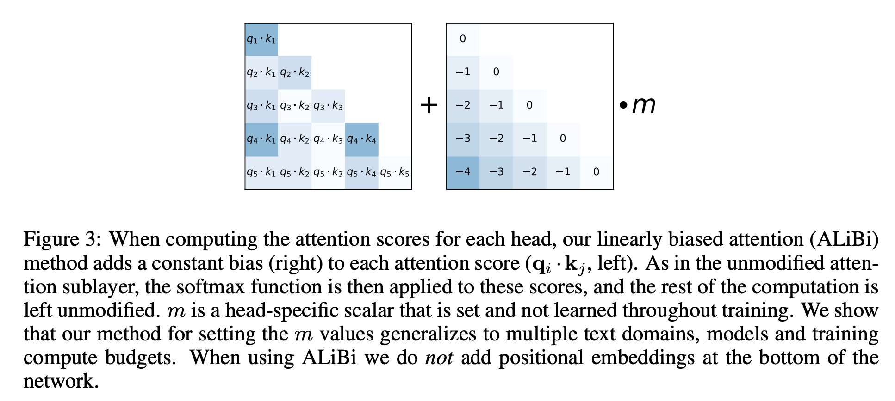
https://paperswithcode.com/method/alibi

https://youtu.be/-Kgxv64aG3o explain Sinusoidal and compare it to ALiBi

Implementation https://nn.labml.ai/transformers/alibi/index.html

- - -

ALiBi author video https://www.youtube.com/watch?v=Pp61ShI9VGc

Trong bài báo gốc về tfm, họ nói rằng tfm may exactly stick with longer than the ones encountered during training. The first thing that we didn't have by is we actually tested this thing so this game was made in 2017 but nobody actually looked into it in the paper. And the first thing we wonna do is we're going to figure out if this thing is correct. Can tfm actually do inference on sequences that are longers than what they saw during training? So here is how we are going to test it: we train a LM length of 1024, trained on WikiText103 a dataset of 100m tokens, 247M params.

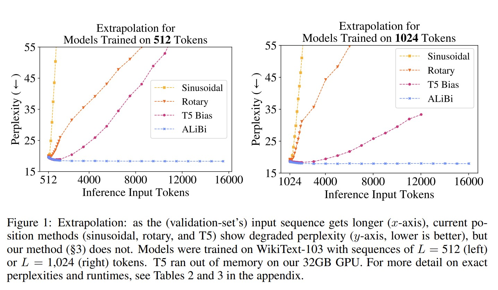

Thực nghiệm này trông có vẻ ngu ngốc vì chúng ta train trên các chuỗi có độ dài 1024, và sau đó kiểm thử trên các chuỗi có độ dài lớn hơn 1024. Bài báo gốc về tfm nêu 2 cách để encode positions, một là learnable cách này không áp dụng được vì 1 khi được huấn luyện pos encode là cố định không mở rộng được. Cách thứ 2 là dùng sinusoidial encoding, cách này có thể mở rộng và họ hy vọng rằng nó sẽ hoạt động tốt khi mở rộng độ dài chuỗi. Chưa ai kiểm chứng giả thiết này và chúng tôi đã làm điều đó, thực tế chỉ ra rằng nó hoạt động không tốt, perplexity của ML tăng lên rất nhanh (đường màu vàng).

=> Kết luận #1: original tfm LMs không thể ngoại suy!

VẬY TẠI SAO NGOẠI SUY LẠI QUAN TRỌNG? Có rất nhiều lý do nhưng đầu tiên là cho dù bạn huấn luyện trên chuỗi ngắn nhưng khi infer bạn chạy được trên chuỗi dài nó sẽ tiết kiệm cho chúng ta rất nhiều tính toán, con người không được huấn luyện trên những chuỗi dài nhưng vãn hiểu được sách và những đoạn văn dài, vì thế nó sẽ tiết kiệm cho chúng ta rất nhiều tính toán khi huấn luyện. Chúng ta đã mất khả năng ngoại suy đó khi rời xa RNNs!

Chúng ta có khả năng đó khi dùng RNNs, chúng ta thường huấn luyện trên chuỗi 100-200 tokens nhưng về lý thuyết RNNs có thể xử lý chuỗi có độ dài vô tận khi infer nhưng tfm không làm được. Đúng là RNNs quên hết mọi thứ nhưng nó không explode, vì thế RNN thực sự làm tốt hơn. You'd probably get dimishing returns in terms of like longer lengths would probably stop and the accidentally ... Đúng rồi, chúng không hiểu gì dài hơn few hundred tokens away but they don't explode.

OK, việc tiếp theo chúng tôi thử nghiệm là just change position of bank that we use, and so the first thing that we try is rotary position embeddings, which are like super complicated mapping but none of that mathematics, what they really do is they instead of adding position embeddings to where the representations they dot product position of embeddings and word representation. The second thing we try is T5, một mô hình nổi tiếng, và nhiều người không biết rằng khi giới thiệu T5 họ đã giới thiệu một kiểu pos embedding mới, họ nói rất ít về nó trong bài báo, nhưng nó là một cách mới và duy nhất để model the positionality and khi chúng tôi thử cách đó, nó thực sự cải thiện hiệu năng mặc dù mô hình của chúng tôi không liên quan gì tới T5, chúng tôi chỉ sử dụng pos embedding giống như T5 mà thôi. Chúng tôi huấn luyện với 1k tokens vậy mà chúng tôi có thể mở rộng hiệu quả tới 2k tokens, nhưng sau đó hiệu năng bắt đầu giảm đi.

=> Kết luận #2: ngoại suy là có thể đơn giản bằng cách đổi cách encode position!

Để có thể ngoại suy, chúng tôi tưởng rằng phải thay đổi cơ chế attn, thay đổi pos embedding method, và rất nhiều thứ nữa, nhưng có vẻ như là chỉ cần thay đổi position embedding method has lots of power and can really impact performance.

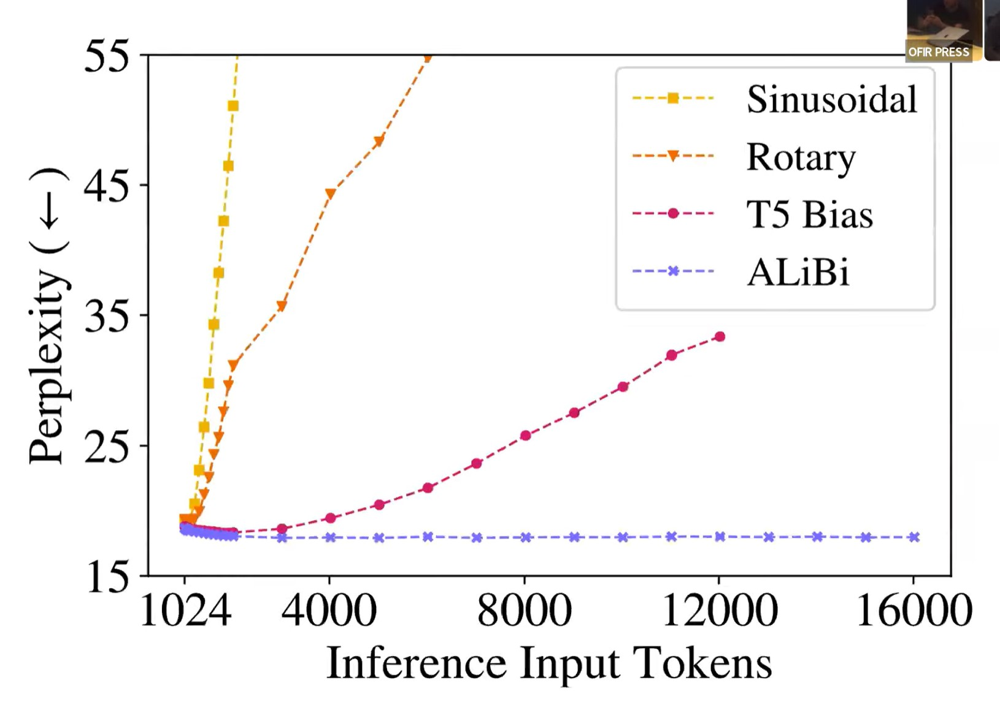
And here is our boy, ALiBi.

=> Kết luận #3: ALiBi is awesome :D

ALiBi thực sự rất dễ để thực thi, chỉ một bước đơn giản:
- step 0: comment out the sinusoidal embeddings
- step 1: add bias to attention scores

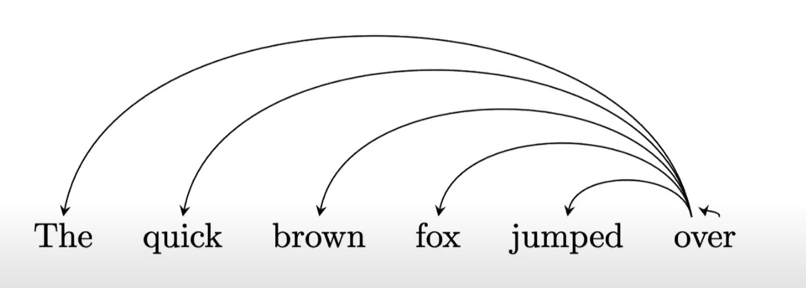
Vì LM là mô hình nhân quản nên với chuỗi từ ở trên và từ cuối cùng dùng làm query và những từ trước nó là keys.x

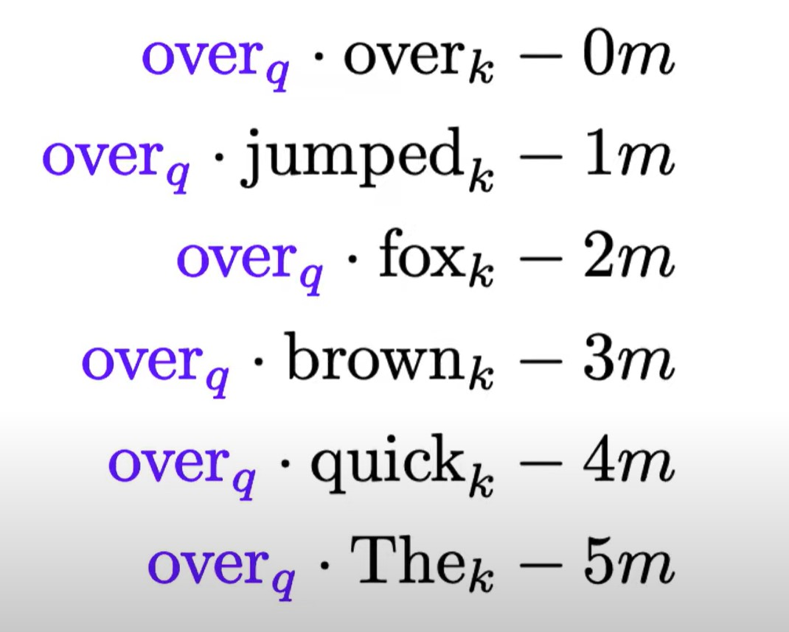
Chúng tôi đơn giản trừ đi bias vào attn scores, từ càng ở xa query càng bị trừ nhiều hơn. Nếu chỉ làm như vậy nó sẽ không hoạt động tốt vì các con số này sẽ tăng quá nhanh vì thế chúng tôi normalize chúng bằng cách nhân với một số m nằm trong khoảng từ 0 tới 1. Và điều thú vị ở đây là đây là phần cốt lõi nhất của ALiBi, chúng ta thực hiện multi-head attn và vì thế bất cứ cái gì bạn attend bạn làm nó với a tension of 8 or 16, or 32 diff heads, bạn thực sự attend tới chuỗi đầu vào 32 lần khác nhau, và bởi vì chúng ta có hệ số chuẩn hóa m, chúng ta có thể do something really cool here. Nếu chúng ta sử dụng 16 heads, chúng ta có thể sử dụng 16 m khác nhau. And what that does is now we have this distance bias, which grow in different ways. _So if m is really close to 1 if it's really big that means that this function is going to increase really really quickly and so this spike is going to become big very very quickly and so those heads are going to look at very very very few tokens_. I've seen this empirically, I can look at what model is looking at and I can see the head that have high m value they only look at like 5, 6 hoặc 10 tokens. Và ngược lại với m gần với 0 thì attn sẽ nhìn vào context rất dài như là 1000-2000 tokens away. Và vì thế khi thực thi Alibi tôi thấy sự cần thiết phải có nhiều giá trị m. And this inductive bias will forces heads to behave differently. Điều này rất khác với attn truyền thống, mặc dù được khởi tạo và update khác nhau nhưng về cơ bản độ dài quan sát của chúng là giống nhau.

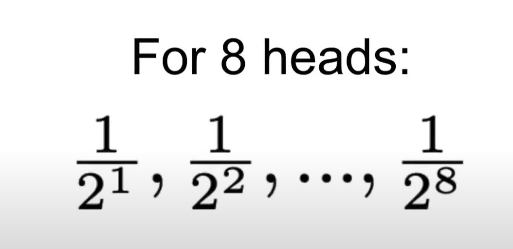
Lưu ý là m không được huấn luyện, mà là được thiết lập bằng tay. Tại sao lại vậy? Vì khi thiết lập đơn giản như trên chúng hoạt động rất tốt với nhiều tác vụ NLP, thậm chí ảnh. Còn khi được huấn luyện chúng làm việc train model chậm hơn và đôi khi gặp trục trặc.

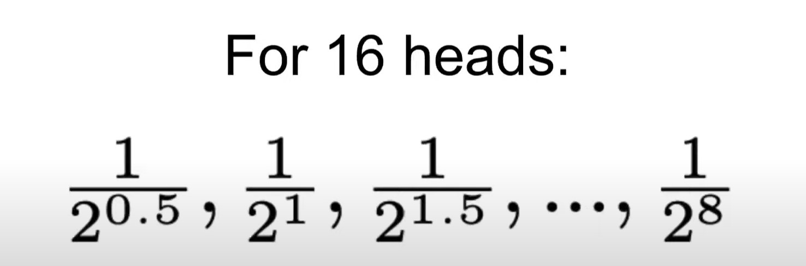

## Triển khai
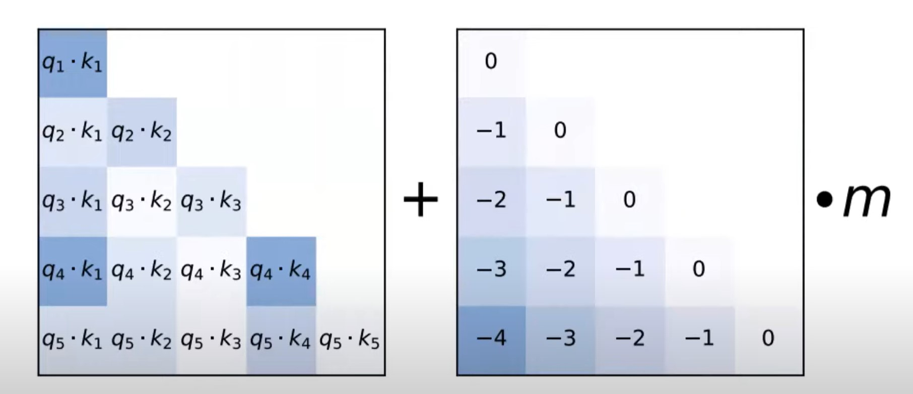

ALiBi rất hiệu quả:
- Không cần pos embd
- ALiBi chạy nhanh như sinusoidal
- Không cần thêm parmas như T5
- Đôi khi ALiBi cần thêm 100MB bộ nhớ 

## Interesting discussions https://youtu.be/Pp61ShI9VGc?t=1270

Quay trở lại ví dụ với Sinusoidal và xem tại sao nó lại explode. Tôi tin rằng tfm lm huấn luyện pos embedding over fit to specific position. Tôi giả thiết rằng, tfm nghĩ rằng dog at five and dog at six are two different but similar concepts, which are similar but different to dog seven which is similar but different to dog at eight. Khi chúng ta đưa cho tfm position embedding, chúng ta chỉ muốn nó hiểu khoảng cách tương đối giữa các từ, nhưng cuối cùng nó lại overfiting to specific positions and __the only reason that GPT-3 works is because their training datasets are so massive, they've just seen everywhere at basically every single position and that's why we kind of feel like they can kind of generalize the stuff but they don't__ If you give them position of writing I really believe that they over fit to specific position rings and I have bunch of experiments where that's really make me strongly believe this thing.

Một trong những bằng chứng là khi huấn luyện mô hình với 250m params, nó có thể ngoại suy thêm 50 tokens, nghĩa là huấn luyện với 1024 và nó works ok với 1025, 1026, và chỉ explode từ 1070. Mặt khác khi ta huấn luyện 1.3B model, nó exploded right away, nghĩa là ta huấn luyện nó với 1024 và cho nó 1025 tokens and right away the perplexity went through the roof. And we know that larger model have more capacity to overfit more and that's one of piece of evidence that makes you think that tfm overfit the specific position of things. ...

Một bằng chứng nữa là chúng tôi chỉ huấn luyện ALiBi với L = 512 rồi cho nó ngoại suy ra với chuỗi có độ dài từ 513 tới 3072. Chúng tôi so sánh hiệu suất của cách đó với việc huấn luyện Sinusoidal cho các độ dài khác nhau. Và thật ngạc nhiêu ALiBi không được huấn luyện tại L > 512 hoạt động tốt hơn Sinusoidal đã được huấn luyện tại L.

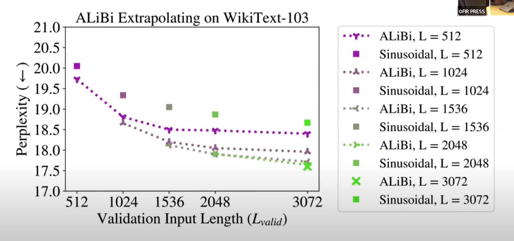
Và khi ALiBi được huấn luyện với L lớn hơn, nó càng hoạt động tốt hơn :D

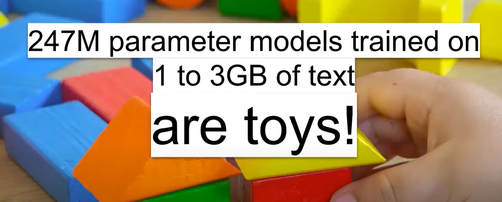

Hãy thử nghiệm với model lớn hơn
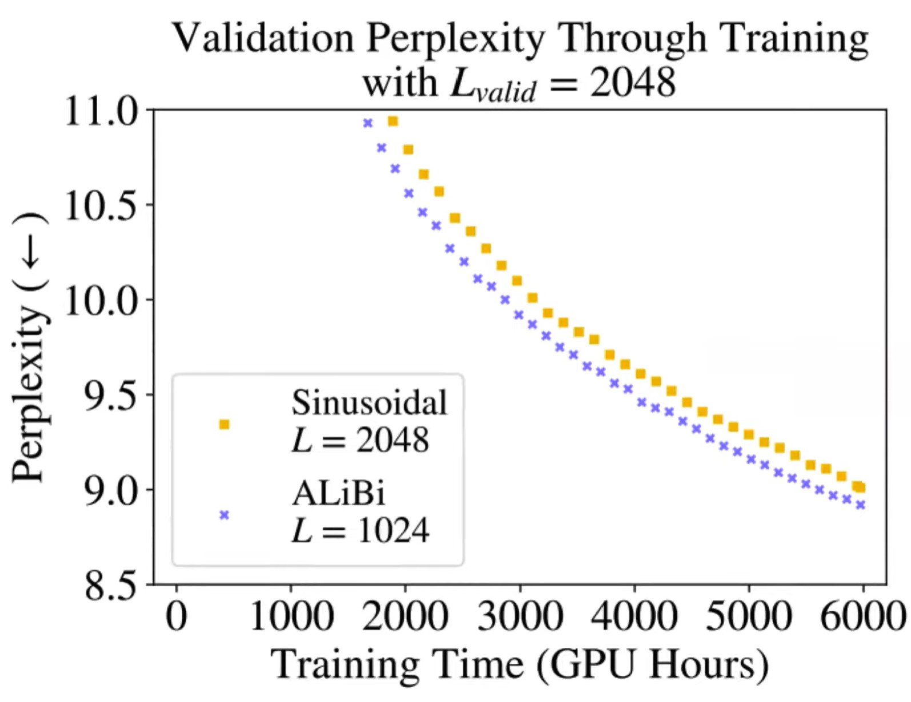
Kết quả là ALiBi luôn tốt hơn!

- - -

https://ofir.io/The-Use-Case-for-Relative-Position-Embeddings

We’re in 2022 but many of our most popular causal language models (LMs), including GPT-3, still use absolute positional embeddings. I believe we should stop using those and move to relative positional embeddings such as ALiBi. Deepmind’s Gopher and BigScience’s BLOOM already use relative positioning methods, and I’ve heard that multiple upcoming models also will, and so hopefully this post will help in encouraging the remanining holdouts to follow suit.

https://arxiv.org/abs/2210.12574
The Curious Case of Absolute Position Embeddings
