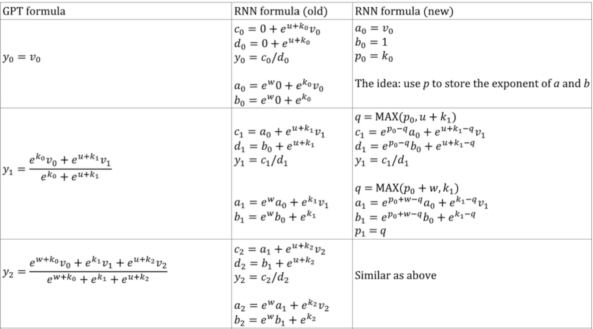
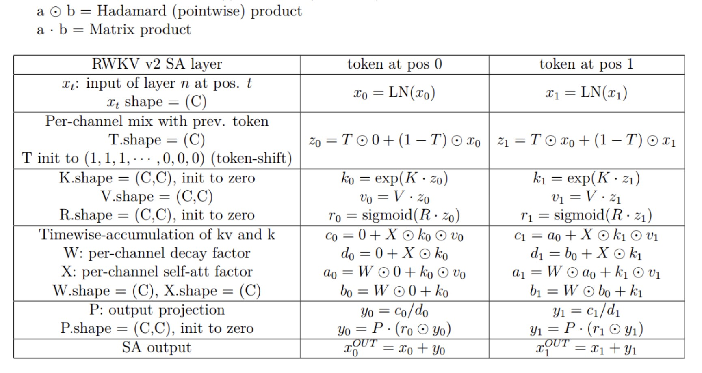
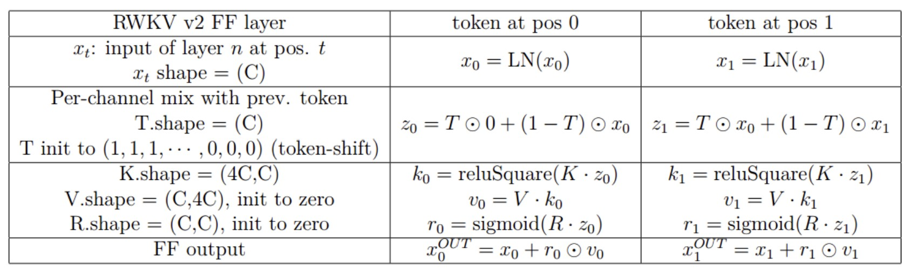

https://github.com/BlinkDL/RWKV-LM

# Công thức toán học

__RWKV is like [AFT](./aft.md) with special w_{k, k'}__


__Triển khai công thức GPT thành công thức RNN__

## Từ GPT tới RWKV
- Gọi `F[t]` là trạng thái hệ thống tại (thời điểm) t.
- Gọi `x[t]` là đầu vào mới tại t.
- Để GPT dự đoán F[t+1] cần cân nhắc F[0],F[1]...F[t] vì thế nó cần O(T^2) để sinh ra một chuỗi có độ dài T.

Công thức đơn giản hóa của GPT là:
`F[t+1] = sum_{i=0}^t( exp(Q x[t] * K F[i]).(V F[i]) ) / sum_{i=0}^t( exp(Q x[t] * K F[i]) )`
Công thức này rất mạnh mẽ về mặt lý thuyết nhưng trên thực tế không có nghĩa là chúng ta có thể tận dụng hết khả năng của nó với những thuật toán tối ưu hóa thông thường. Loss landscape là rất khó với những phương pháp tối ưu đang có. Hay nói cách khác là cơ chế self-attn là phức tạp đối với các optimizers hiện tại.

So sánh với công thức đơn giản hóa của rwkv ở chế độ song song, nó giống như Apple's aft:
`F[t+1] = sigma(R_x[t]).sum_{i=0}^t( exp(W.(t-i)).exp(K F[i]).(V F[i]) ) / sum_{i=0}^t( exp(W.(t-i)).exp(K F[i]) )`
R,K,V là các ma trận trọng số (có thể huấn luyện được), W là vector trọng số có thể huấn luyện được (phân rã thời gian cho từng channel).

Với GPT, đóng góp của F[t] vào F[t+1] cân đo bằng `exp(Q x[t] mul K F[i])`

với rwkv, đóng góp của F[t] vào F[t+1] cân đo bằng `sigma(R_x[t]) . exp(W.(t-i)).exp(K F[i])`

- `sigma` là hàm phi tuyến tính và ở đây chúng ta dùng hàm sigmoid
- Lưu ý `sigma(R x[t])` không phải là mẫu số mà ta gọi R là "receptance" (sự rung lắc trên từng đơn vị lực tác động)
- `exp(W.(t-i))` là hệ số phân rã theo thời gian (của từng channel). Ý tưởng này giống như scaling the attention by distance được Peng Bo đề xuất 2020 được gọi là [time-weighting](#time-weighting-trick)

## Punchline
Ta có thể viết lại công thức gpt ở trên thành rnn (công thức hồi quy):
- F[1] = sigma(R x[0]) . exp(K F[0]).(V F[0])/exp(K F[0])
- F[2] = sigma(R x[1]) . exp(K F[1]).(V F[1]) + exp(W).exp(K F[0]).(V F[0])/exp(K F[1]) + exp(W).exp(K F[0])
Vì thế có thể dễ dàng thấy:
`F[t+1] = sigma(R x[t+1]) . exp(K F[t]).(V F[t]) + exp(W).A[t] / exp(K F[t]) + exp(W).B[t]` với A[t] và B[t] là tử số và mẫu số của bước t trước đó.

Peng Bo tin rằng rwkv có hiệu năng tốt là nhờ W is like repeatedly applying a diagonal matrix. 
Note `(P^{-1} D P)^n = P^{-1} D^n P`, so it is similar to repeatedly applying a general diagonalizable matrix (ma trận chéo hóa được). Hơn thế nữa nó có thể được biến thành continuous ODE (a bit similar to State Space Models). (TODO: tìm hiểu về diagonal matrix, ODE, State Space Models).

## time-weighting trick
https://github.com/BlinkDL/minGPT-tuned

```py
self.time_weighting = nn.Parameter(torch.ones(self.n_head, config.block_size, config.block_size))
......
att = F.softmax(att, dim=-1)
att = att * self.time_weighting[:,:T,:T] # this is "time-weighting"
att = self.attn_drop(att)
```
Time-weighting works bởi vì tokens từ các khoảng cách khác nhau sẽ có những impacts khác nhau vào token đang xét. Hơn nữa hiệu ứng self-attn sẽ bị thay đổi ở những tokens xuất hiện sớm bởi vì chúng có cửa sổ lịch sử ngắn hơn.
p.s. bởi vì time_weigting gần như là một ma trận tuần hoàn (mostly a circulant matrix), sử dụng code sau để tiết kiệm tham số:
```py
self.time_weight = nn.Parameter(torch.ones(self.n_head, config.block_size))
self.time_bias = nn.Parameter(torch.ones(self.n_head, 1, config.block_size)) # dealing with early tokens 
......
ww = F.pad(self.time_weight, (0, TT))
ww = torch.tile(ww, [TT])
ww = ww[:, :-TT].reshape(-1, TT, 2 * TT - 1)
ww = ww[:, :, TT-1:]
ww = ww[:, :T, :T] # make a circulant matrix
time_weighting = ww * self.time_bias[:, :, :T]
```

# How it works?
rwkv tập hợp thông tin vào các kênh (token là vector, mỗi scalar value của vector được gọi là 1 channel - kênh), các kênh này phân rã theo thời gian với tốc độ khác nhau khi chuyển tới token tiếp theo.

rwkv có thể song song hóa được là nhờ hệ số phân ra theo thời gian của từng kênh là độc lập với với dữ liệu mặc, và hệ số này có thể huấn luyện được. Ví dụ, với rnn thông thường bạn có thể điều chỉnh hệ số phân rã của một kênh từ 0.8 xuống 0.5 (chúng được gọi là gates - cổng), trong khi đó rwkv đơn giản là chuyển thông tin từ kênh W-0.8 vào kênh W-0.5 để đạt được hiệu ứng tương tự. Hơn thế nữa bạn có thể tinh chỉnh (fine-tune) rwkv thành rnn không song song nếu bạn muốn hiệu năng cao hơn.

RWKV is inspired by Apple's AFT (https://arxiv.org/abs/2105.14103).

Moreover it's using a number of my tricks, such as:

* [__SmallInitEmb__](https://github.com/BlinkDL/SmallInitEmb): (applicable to all transformers) which helps the embedding quality, and stabilizes Post-LN (which is what I am using).

* [__Token-shift__](https://github.com/BlinkDL/RWKV-LM#token-shift-time-shift-mixing): (applicable to all transformers), especially helpful for char-level models.

* [__Head-QK__](https://github.com/BlinkDL/RWKV-LM#the-head-qk-trick-learning-to-copy-and-avoid-tokens): (applicable to all transformers). Note: it's helpful, but I disabled it in the Pile model to keep it 100% RNN.

* __Extra R-gate in the FFN__ (applicable to all transformers). I am also using reluSquared from Primer.

* __Better initilization__: I init most of the matrices to ZERO [see RWKV_Init](https://github.com/BlinkDL/RWKV-LM/blob/main/RWKV-v2-RNN/src/model.py).

* __You can transfer some parameters__ from a small model to a large model (note: I sort & smooth them too), for [faster and better convergence](https://www.reddit.com/r/MachineLearning/comments/umq908/r_rwkvv2rnn_a_parallelizable_rnn_with).

* (__CUDA kernel__)(https://github.com/BlinkDL/RWKV-LM/tree/main/RWKV-v4neo/cuda) to speedup training.

- - -

# pseudocode 
https://github.com/BlinkDL/RWKV-LM#the-pseudocode-execution-from-top-to-bottom

## rwkv-2
- Là RNN nhưng có thể được huấn luyện như GPT transformer
- Chỉ cần {x_t, a_t, b_t} của vị trí t để tính ra vector của t+1
- Nó nhanh hơn và tiết kiệm VRAM hơn GPT 100 lần

### Tầng self-attn

- x_t là đầu vào của tầng n tại vị trí t, x_t.shape = (C), C là độ dài vector và cũng là số channels
- Ma trận trọng số K: K.shape = (C,C) init to zero
- Ma trận trọng số V: V.shape = (C,C)
- Ma trận trọng số R: R.shape = (C,C) init to zero
- Token-shift Ts init to (1,1,1,...,0,0,0), Ts.shape = (C) (C//2 values đầu là 1, C//2 values sau là 0)
- `z_t = Ts*x_{t-1} + (1 - Ts)*x_t` trộn x_t với token x_{t-1} 
- `k_t =     exp(K @ z_t)`
- `v_t =        (V @ z_t)`
- `r_t = sigmoid(R @ z_t)`
- Tích lũy theo thời gian của kv và k
  - `W`: vector hệ số phân rã của từng channel, W.shape = (C)
  - `X`: vector hệ số self-attn của từng channel, X.shape = (C)
- `a_0 = W*0 + k_0*v_0`
- `b_0 = W*0 + k_0`
- `c_t = a_{t-1} + X*k_t * v_t` tử số (numerator)
- `d_t = b_{t_1} + X*k_t`      mẫu số (denominator)
- `a_t = W*a_{t-1} + k_t*v_t`
- `b_t = W*b_{t-1} + k_t`
- `y_t = r_t * c_t / d_t`
- `P`: ouput projection, p.shape = (C, C), init to zero
- Self-attn output `out_t = x_t + P @ (y_t)`

Notes:
- Ta dùng giá trị khởi tạo được tính toán trước cho W, giá trị W khác nhau cho từng channels khác nhau, và W nhỏ hơn (phân rã nhanh hơn) cho các tầng phía trước.
- Ta cần "khóa" k và cộng  thêm epsilon vào d để tránh overflows.
- Các hệ số a,b,c,d làm việc cùng nhau để xây dựng một đường cong phân rã theo thời gian [X, 1, W, W^2, W^3, ...]
- a và b là EMAs của kv và k
- c và d là a và b kết hợp với "self-attn"

### Tầng FF

- x_t là đầu vào của tầng n tại vị trí t, x_t.shape = (C)
- Ma trận trọng số K: K.shape = (4C,C)
- Ma trận trọng số V: V.shape = (C,4C) init to zero
- Ma trận trọng số R: R.shape = (C, C) init to zero
- Token-shift Ts init to (1,1,1,...,0,0,0), Ts.shape = (C) (C//2 values đầu là 1, C//2 values sau là 0)
- `z_t = Ts*x_{t-1} + (1 - Ts)*x_t` trộn x_t với token x_{t-1} 
- `k_t = reluSquare(K @ z_t}`, k_t.shape = (4C)
- `r_t =    sigmoid(R @ z_t)`, r_t.shape = (C)
- `v_t =           (V @ k_t)`, v_t.shape = (C)
- FF output, `out_t = x_t + r_t * v_t`, out.shape = (C)

Notes:
- kv / k là cơ chế ghi nhớ. Token với giá trị k cao sẽ được ghi nhớ lâu hơn nếu W gần với 1 trong channel đang xét.
- R-gate là quan trọng với hiệu năng.
  - k = sức mạnh thông tin của token đang xét, sẽ được chuyển tiếp tới các tokens trong tương lai.
  - r = liệu có áp dụng thông tin vào token đang xét hay không

## RWKV-3 improvements
1/ Sử dụng hệ số time_mix có thể huấn luyện được cho R,K,V trong tầng SA và tầng FF. Ví dụ:  
```py
xx = self.time_shift(x)
xk = x * self.time_mix_k + xx * (1 - self.time_mix_k)
xv = x * self.time_mix_v + xx * (1 - self.time_mix_v)
xr = x * self.time_mix_r + xx * (1 - self.time_mix_r)
```

2/ Sử dụng preLN (tiền layernorm) thay vì postLN (hậu layernorm) => ổn định hơn và hội tụ nhanh hơn:
```py
if self.layer_id == 0: x = self.ln0(x)
x = self.att(self.ln1(x))
x = self.ffn(self.ln2(x))
# ... (minh họa việc dùng LN sau embedding và trước att và ffn)
```

## Explaining the code for RWKV-3 GPT mode
https://github.com/BlinkDL/RWKV-LM#explaining-the-code-for-rwkv-3-gpt-mode

### The GPT mode - overview
Các khối của rwkv-3 giống như các khối của preLN GPT thường thấy. Khác biệt ở chỗ có một LN thêm vào sau embedding. Lưu ý là bạn có thể hấp thụ LN này vào embedding sau khi kết thúc huấn luyện. 
```py
x = self.emb(idx)  # input: idx = token indices
x = self.ln_emb(x) # extra LN after embedding
x = x + self.att_0(self.ln_att_0(x)) # preLN
x = x + self.ffn_0(self.ln_ffn_0(x)) # preLN
...
x = x + self.att_n(self.ln_att_n(x))
x = x + self.ffn_n(self.ln_ffn_n(x))
x = self.ln_head(x) # final LN before projection
x = self.head(x)    # output: x = logits
```
- Việc khởi tạo trọng số embedding siêu nhỏ là rất quan trọng, ví dụ `nn.init.uniform_(a=-1e-4,b=1e-4)` để có thể sử dụng [SmallInitEmb trick](#smallinitemb-trick).
- Với mô hình 1.5B rwkv-3, Peng Bo sử dụng Adam (no weigh-decay, no dropout) trên 8 * A100 40G
- batch_size = 32 * 896, ctx_len = 896, vì sử dụng tf32 nên batch_size trở nên nhỏ hơn
- Với 15B tokens đầu tiên, learning_rate is fixed at 3e-4, và beta=(0.9,0.99)
- Sau đó set beta = (0.9,0.999) và do an expoential decay of learing_rate, reaching 1e-5 at 332B tokens.

### SmallInitEmb trick
https://github.com/BlinkDL/SmallInitEmb

Peng Bo nhận thấy khi huấn luyện tfm, ma trận embedding thay đổi rất chậm, và điều đó khiến cho model "khó thoát" ra khỏi embedding khởi tạo nhiễu loạn lúc đầu.
```
( initial embedding )
[[-0.0073  0.0062 -0.0261 ...  0.0086  0.0107 -0.008 ] ... ]
( after 1 step, the directions of the embedding vectors 
  are not moved much because the numbers change by LR = ~4e-4 )
[[-0.0069  0.0066 -0.0265 ...  0.009   0.0111 -0.0084] ... ]
```
Vì thế Peng Bo đề xuất khởi tạo giá trị ma trận embedding siêu nhỏ và cho thêm một LayerNorm ngay phía sau nó:
```py
if isinstance(module, (nn.Embedding)):
    nn.init.uniform_(module.weight, a=-1e-4, b=1e-4) # SmallInit(Emb)
...
if self.config.USE_SMALL_EMB and self.layer_id == 0:
    x = self.lnPre(x) # LN(SmallInit(Emb))
x = x + self.att(self.ln1(x))
x = x + self.ffn(self.ln2(x))
```
Nhờ vậy việc hội tụ được cải thiện, đặc biệt với BPE, bởi vì model có thể nhanh chóng nhảy ra khỏi embedding khởi động rất nhỏ lúc đầu: thay đổi nhỏ ở bước 1 -> thay đổi đáng kể ở các hướng -> thay đổi lớn sau khi LN.

Bạn cũng có thể trực tiếp huấn luyện PostLN thay vì làm nóng với LN(SmallInitEmb)
```py
if isinstance(module, (nn.Embedding)):
    nn.init.uniform_(module.weight, a=-1e-4, b=1e-4) # SmallInit(Emb)
...
x = self.ln1(x) # this plays the same role as the lnPre in the above PreLN code
x = x + self.att(x)
x = self.ln2(x)
x = x + self.ffn(x)
(note you shall have another LN after the final ffn)
```

### The GPT mode - ATT block
Note: rwkv-3 không sử dụng attention như cách thông thường nhưng hãy cứ gọi nó là att.
```py
B, T, C = x.size() # x = (Batch, Time, Channel)
# BTC = bitcoin? No! it's Batch, Time, and Channel :D

# Mix `x` with the previous timestep to produce xk, xv, xr
xx = self.time_shift(x) # self.time_shift = nn.ZeroPad2d((0,0,1,-1))
xk = x * self.time_mix_k + xx * (1 - self.time_mix_k)
xv = x * self.time_mix_v + xx * (1 - self.time_mix_v)
xr = x * self.time_mix_r + xx * (1 - self.time_mix_r)

# Use xk, xv, xr to produce k, v, r
k = self.key(xk).transpose(-1, -2)
v = self.value(xv).transpose(-1, -2)
r = self.receptance(xr)
k = torch.clamp(k, max=60) # clamp k to avoid overflow
k = torch.exp(k)
kv = k * v

# Compute the W-curve = [e^(-n * e^time_decay), e^(-(n-1) * e^time_decay), ..., 1, e^(time_first)]
self.time_w = torch.cat([torch.exp(self.time_decay) * self.time_curve.to(x.device), self.time_first], dim=-1)
w = torch.exp(self.time_w)

# Use W to mix kv and k respectively. Add K_EPS to wk to avoid divide-by-zero
if RUN_DEVICE == 'cuda':
    wkv = TimeX.apply(w, kv, B,C,T, 0)
    wk = TimeX.apply(w, k, B,C,T, K_EPS)
else:
    w = w[:,-T:].unsqueeze(1)
    wkv = F.conv1d(nn.ZeroPad2d((T-1, 0, 0, 0))(kv), w, groups=C)
    wk = F.conv1d(nn.ZeroPad2d((T-1, 0, 0, 0))(k), w, groups=C) + K_EPS

# The RWKV formula
rwkv = torch.sigmoid(r) * (wkv / wk).transpose(-1, -2)
rwkv = self.output(rwkv) # final output projection
```
Notes:
- `self.key, self.receptance, self.ouput` là các ma trận được khởi tạo là zero.
- `time_mix, time_decay, time_first` là các vectors được transfer từ một mô hình nhỏ hơn đã được huấn luyện (a.k.a tranfer learning) và đã được sort & smooth.
- rwkv-3 khác rwkv-2 ở chỗ W (hệ số phân rã thời gian) được tính từ time_decay và time_mix.

### The GPT mode - FFN block
Khối FFN áp dụng 3 mẹo nếu so sánh với GPT thông thường:

1. Peng Bo's time_mix trick.
2. The [sqReLU](./sqrelu.md) from the Primer paper.
3. An extra receptance-gate (similar to the receptance-gate in attn block).

```py
# Mix x with the previous timestep to produce xk, xr
xx = self.time_shift(x)
xk = x * self.time_mix_k + xx * (1 - self.time_mix_k)
xr = x * self.time_mix_r + xx * (1 - self.time_mix_r)

# The usual FFN operation
k = self.key(xk)
k = torch.square(torch.relu(k)) # from the Primer paper
kv = self.value(k)

# Apply an extra receptance-gate to kv
rkv = torch.sigmoid(self.receptance(xr)) * kv
return rkv
```

## RWKV-4 improvements
https://github.com/BlinkDL/RWKV-LM/tree/main/RWKV-v4neo/cuda

```c
__global__ void kernel_forward(const int B, const int T, const int C,
                               const F * const _w, const F * const _u, 
                               const F * const _k, const F * const _v, F * const _y) {
    const int idx = blockIdx.x * blockDim.x + threadIdx.x; // global index
    const int _b = idx / C; // mẻ thứ _b của ma trận đầu vào
    const int _c = idx % C; // channel thứ _c đang xem xét (_c = 0..C)
    const int _offset = _b * T * C + _c;

    F u = _u[_c]; // giá trị channel _c của _u = khởi tạo W_0
    F w = _w[_c]; // gia trị channel _c của _w = time-decay của W_c
    const F *__restrict__ const k = _k + _offset; // trỏ tới channel _c của key (để lấy giá trị)
    const F *__restrict__ const v = _v + _offset; // trỏ tới channel _c của value (để lấy giá trị)
          F *__restrict__ const y = _y + _offset; // trỏ tới channel _c của đầu ra (để gán giá trị)

    F p = 0, q = 0, o = MIN_VALUE;
    // p and q are running sums divided by exp(o) (to avoid overflows)
    for (int i = 0; i < T; i++) { // với mỗi token trong T token x_i
        const int ii = i * C; // trỏ tới giá trị channel _c của token x_i

        F no = max(o, u + k[ii]);
        F A = exp(o - no);
        F B = exp(u + k[ii] - no);
        y[ii] = (A*p + B*v[ii]) / (A*q + B);

        no = max(w + o, k[ii]);
        A = exp(w + o - no);
        B = exp(k[ii] - no);
        p = A*p + B*v[ii];
        q = A*q + B;
        o = no;
    }
}
```
Note: rwkv-4 sử dụng công thức rnn mới


https://github.com/BlinkDL/RWKV-LM/blob/main/RWKV-v4neo/src/model.py#LL99
```py
class RWKV_TimeMix(MyModule): # time mix là ATT layer
    def __init__(self, args, layer_id):
        super().__init__()
        self.args = args
        self.layer_id = layer_id
        self.ctx_len = args.ctx_len
        self.n_embd = args.n_embd
\        attn_sz = args.n_embd

        with torch.no_grad():  # fancy init
            ratio_0_to_1 = layer_id / (args.n_layer - 1)  # 0 to 1
            ratio_1_to_almost0 = 1.0 - (layer_id / args.n_layer)  # 1 to ~0

            # fancy time_decay
            decay_speed = torch.ones(attn_sz)
            for h in range(attn_sz):
                decay_speed[h] = -5 + 8 * (h / (attn_sz - 1)) ** (0.7 + 1.3 * ratio_0_to_1)
            self.time_decay = nn.Parameter(decay_speed)

            # fancy time_first
            zigzag = torch.tensor([(i + 1) % 3 - 1 for i in range(attn_sz)]) * 0.5
            self.time_first = nn.Parameter(torch.ones(attn_sz) * math.log(0.3) + zigzag)

            # fancy time_mix
            x = torch.ones(1, 1, args.n_embd)
            for i in range(args.n_embd): x[0, 0, i] = i / args.n_embd

            self.time_mix_k = nn.Parameter(torch.pow(x, ratio_1_to_almost0))
            self.time_mix_v = nn.Parameter(torch.pow(x, ratio_1_to_almost0) + 0.3 * ratio_0_to_1)
            self.time_mix_r = nn.Parameter(torch.pow(x, 0.5 * ratio_1_to_almost0))

        self.time_shift = nn.ZeroPad2d((0, 0, 1, -1))
        self.key = nn.Linear(args.n_embd, attn_sz, bias=False)
        self.value = nn.Linear(args.n_embd, attn_sz, bias=False)
        self.receptance = nn.Linear(args.n_embd, attn_sz, bias=False)

        self.output = nn.Linear(attn_sz, args.n_embd, bias=False)


    @MyFunction
    def jit_func(self, x):
        # Mix x with the previous timestep to produce xk, xv, xr
        xx = self.time_shift(x)
        xk = x * self.time_mix_k + xx * (1 - self.time_mix_k)
        xv = x * self.time_mix_v + xx * (1 - self.time_mix_v)
        xr = x * self.time_mix_r + xx * (1 - self.time_mix_r)

        # Use xk, xv, xr to produce k, v, r
        k = self.key(xk)
        v = self.value(xv)
        r = self.receptance(xr)
        sr = torch.sigmoid(r)

        return sr, k, v

    def forward(self, x):
        B, T, C = x.size()  # x = (Batch, Time, Channel)
        sr, k, v = self.jit_func(x)

        rwkv = sr * RUN_CUDA.apply(B, T, C, self.time_decay, self.time_first, k, v) # WKV.apply(B, T, C, w, u, k, v)
        rwkv = self.output(rwkv)
        return rwkv


class RWKV_ChannelMix(MyModule): # channel mix là FFN layer
    def __init__(self, args, layer_id):
        super().__init__()
        self.args = args
        self.layer_id = layer_id
        self.my_testing = self.args.my_testing
        self.time_shift = nn.ZeroPad2d((0, 0, 1, -1))

        with torch.no_grad():  # fancy init of time_mix
            ratio_1_to_almost0 = 1.0 - (layer_id / args.n_layer)  # 1 to ~0

            x = torch.ones(1, 1, args.n_embd)
            for i in range(args.n_embd): x[0, 0, i] = i / args.n_embd

            self.time_mix_k = nn.Parameter(torch.pow(x, ratio_1_to_almost0))
            self.time_mix_r = nn.Parameter(torch.pow(x, ratio_1_to_almost0))

        hidden_sz = 4 * args.n_embd
        self.key = nn.Linear(args.n_embd, hidden_sz, bias=False)
        self.receptance = nn.Linear(args.n_embd, args.n_embd, bias=False)
        self.value = nn.Linear(hidden_sz, args.n_embd, bias=False)

    @MyFunction
    def forward(self, x):
        xx = self.time_shift(x)
        xk = x * self.time_mix_k + xx * (1 - self.time_mix_k)
        xr = x * self.time_mix_r + xx * (1 - self.time_mix_r)

        k = self.key(xk)
        k = torch.square(torch.relu(k))
        kv = self.value(k)

        rkv = torch.sigmoid(self.receptance(xr)) * kv
        return rkv

########################################################################################################
# The RWKV Model with our blocks
########################################################################################################
class Block(nn.Module):
    def __init__(self, args, layer_id):
        super().__init__()
        self.args = args
        self.layer_id = layer_id

        self.ln1 = nn.LayerNorm(args.n_embd)
        self.ln2 = nn.LayerNorm(args.n_embd)

        if self.layer_id == 0:
            self.ln0 = nn.LayerNorm(args.n_embd)
            if args.my_pos_emb > 0:
                self.pos_emb_x = nn.Parameter(torch.zeros((1,args.my_pos_emb,args.n_embd)))
                self.pos_emb_y = nn.Parameter(torch.zeros((args.my_pos_emb,1,args.n_embd)))

        if self.layer_id == 0 and self.args.pre_ffn > 0:
            self.ffnPre = RWKV_ChannelMix(args, 0)
        else:
            self.att = RWKV_TimeMix(args, layer_id)

        self.ffn = RWKV_ChannelMix(args, layer_id)
        
        # Tiny self-attention to address long ctx 
        if args.tiny_att_dim > 0 and self.layer_id == args.tiny_att_layer:
            self.tiny_ln = nn.LayerNorm(args.n_embd)
            self.tiny_q = nn.Linear(args.n_embd, args.tiny_att_dim, bias=False)
            self.tiny_k = nn.Linear(args.n_embd, args.tiny_att_dim, bias=False)
            self.tiny_v = nn.Linear(args.n_embd, args.n_embd, bias=False)
            self.register_buffer("tiny_mask", torch.tril(torch.ones(args.ctx_len, args.ctx_len)))

    def forward(self, x, x_emb=None):
        args = self.args
        B, T, C = x.size()
        if self.layer_id == 0:
            x = self.ln0(x)
            if args.my_pos_emb > 0:
                pos_emb = (self.pos_emb_x + self.pos_emb_y).reshape(T+1, -1)[:-1,:]
                x = x + pos_emb

        if self.layer_id == 0 and args.pre_ffn > 0:
            x = x + self.ffnPre(self.ln1(x))
        else:
            x = x + self.att(self.ln1(x))
        x = x + self.ffn(self.ln2(x))

        if args.tiny_att_dim > 0 and self.layer_id == args.tiny_att_layer:
            xx = self.tiny_ln(x)
            q = self.tiny_q(xx)[:, :T, :]
            k = self.tiny_k(xx)[:, :T, :]
            c = (q @ k.transpose(-2, -1)) * (args.tiny_att_dim ** (-0.5))
            c = c.masked_fill(self.tiny_mask[:T, :T] == 0, 0)
            x = x + c @ self.tiny_v(x_emb)
        return x
```