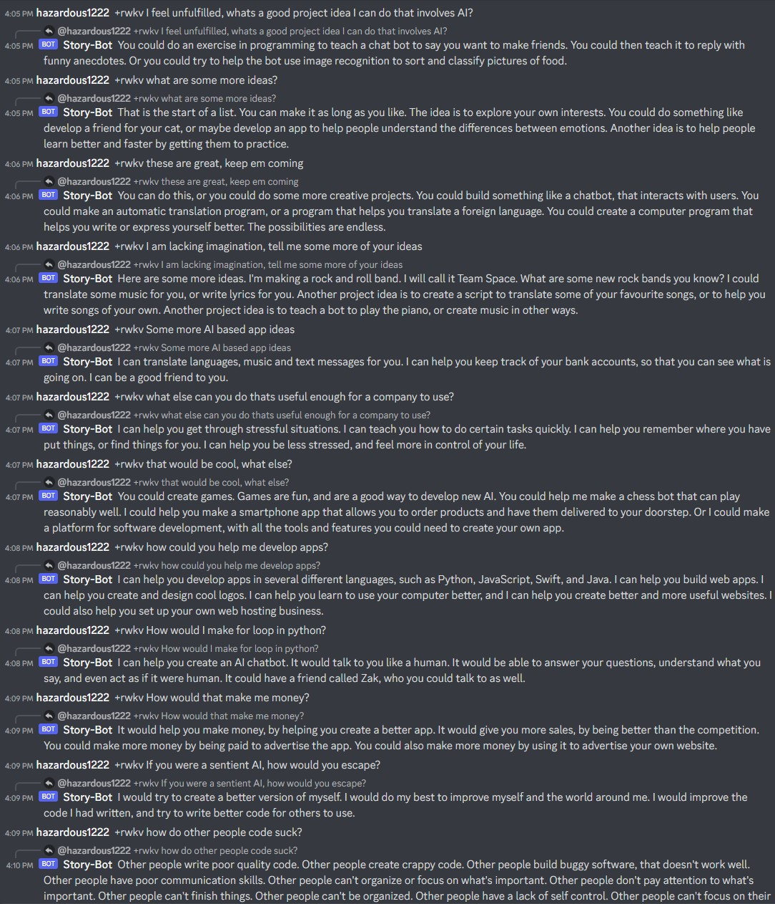
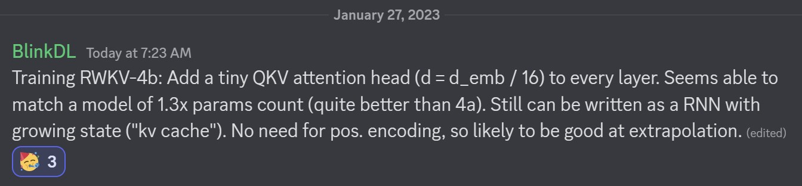

Phần giới thiệu chung này sẽ không đi vào công thức toán hay chi tiết kỹ thuật (xem [rwkv-technical.md](./rwkv-technical.md)), tuy nhiên có những thuật ngữ bạn phải nắm được để hiểu mô hình:

- __att__ / __attn__: cơ chế attention trong học sâu nói chung
- __self-attn__: self-attention trong tfm, độ phức tạp O(N^2)
- __tfm__: mô hình học sâu transformer tiêu chuẩn, sử dụng self-attn
- __linear att / tfm__: transformer sử dụng attn tuyến tính, độ phức tạp O(N)
- __gpt__: generative pre-trained transformer [xem gpt2.md](./gpt2.md)
- __atf__: attention free transformer [xem aft.md](./aft.md)
- __rnn__: recurrent neural network [xem rnn cheatsheet](https://stanford.edu/~shervine/l/vi/teaching/cs-230/cheatsheet-recurrent-neural-networks)
- __gate__: một loại cổng kiểm soát thông tin của rnn (như trong LSTM / GRU)
- __lm__: language model (n-gram, neural network, ...)
- __llm__: large language model (gpt, palm, gato, chinchilla, ...)
- __ctx_len__: context length - độ dài ngữ cảnh của lm (số lượng tokens dùng trong một mẫu huấn luyện)
- __token__: một đơn vị đầu vào của llm, nó là vector đặc trưng có độ dài C
- __channels__: chữ C viết hoa ở trên chính là số lượng kênh của token, mỗi chuỗi scalar values tại một vị trí cố định `c` của các token vectors chính là một kênh. Các kênh này có thể được trộn (mix) với nhau để tạo ra các biến đổi mạnh mẽ hơn.
- __mix__: token mixing, channel mixing [xem mlp-mixer](https://arxiv.org/abs/2105.01601)
- __scaling law__: tăng số lượng tham số và dữ liệu huấn luyện khiến llm hoạt động tốt hơn

# RWKV: Mô hình ngôn ngữ RNN lớn với hiệu năng của Transformer
rwkv là một rnn llm (không dùng attn) với hiệu năng của tfm, nó có thể được huấn luyện song song như gpt tfm. Nó chỉ cần trạng thái ẩn tại vị trí `t` để tính trạng thái của `t+1`. Nó có thể dùng gpt mode để tính nhanh trạng thái ẩn của rnn mode.

Vì thế nó bao gồm những điều tốt đẹp nhất của rnn và tfm: hiệu năng cao, suy diễn nhanh, tiết kiệm bộ nhớ, huấn luyện nhanh, độ dài ngữ cảnh vô hạn ("infinite" ctx_len), và sentence embedding "miễn phí" (sử dụng trạng thái ẩn cuối).

Bạn có thể chạy mô hình rwkv-4 với từ 3 tới 14 tỉ tham số với [rwkv_chatbot](https://github.com/harrisonvanderbyl/rwkv_chatbot/blob/main/Example.ipynb)
```py
# pip install --upgrade pip && pip install --upgrade "jax[cpu]"
# pip install rwkvstic transformers sty inquirer scipy
from rwkvstic.load import RWKV
from rwkvstic.agnostic.backends import JAX
ELDR = "\n\nExpert Long Detailed Response: "
# ELDR = "\n\n"
# model = RWKV("https://huggingface.co/BlinkDL/rwkv-4-pile-7b/resolve/main/RWKV-4-Pile-7B-20230109-ctx4096.pth", mode=JAX)
# model = RWKV("https://huggingface.co/BlinkDL/rwkv-4-pile-14b/resolve/main/RWKV-4-Pile-14B-20230115-5775.pth", mode=JAX)
model = RWKV("https://huggingface.co/BlinkDL/rwkv-4-pile-3b/resolve/main/RWKV-4-Pile-3B-20221110-ctx4096.pth", mode=JAX) # need 16G RAM
model.resetState();t=input("question: ");model.loadContext("\n", t+ELDR);print(model.forward(number=256)["output"])
```
```
q: viết một đoạn văn mô tả cảnh đẹp vịnh Hạ Long
r: 
```


## rwkv rất hiệu quả
- RWKV-3 1.5B on A40 (tf32) = always 0.015 sec/token, simple pytorch code, GPU 45%, VRAM 7.8G
- GPT2-XL 1.3B on A40 (tf32) = 0.032 sec/token (ctx_len 1000), using HF,   GPU 45%, VRAM 9.7G
- Training speed: RWKV-4 1.5B BF16 ctxlen1024 = 106K tokens/s on 8xA100 40G.
- Tốc độ suy diễn rất nhanh ngay cả với CPU vì chỉ cần nhân vector với ma trận, __bạn có thể chạy rwkv trên smartphone__
- Huấn luyện rất trơn tru - no loss spikes (learning_rate và batch_size thay đổi ở 15G tokens)


## Hiệu năng của rwkv tương đương với các gpt transformers


## RWKV: Receptance Weighted Key-Value
> RWKV là tên 4 tham số quan trọng nhất của mô hình

- `r`__receptance__: "sự rung lắc trên từng đơn vị lực tác động". R-gate đóng vai trò quan trọng, nó quyết định sức mạnh thông tin của token có được áp dụng vào vị trí đang xem xét hay không.
- `w` __weighted__: có nghĩa là weighted sum avg của values. W còn là tên của tham số đại diện cho "time decay curves" riêng biệt cho từng channel (nó giống một chút với [ALiBi position embedding](./pose.md) và có thể huấn luyện được)
- `kv` __key-value__: trong Q,K,V của self-attn

Được cải tiến từ aft - một tfm tuyến tính - nên rwkv thừa hưởng những tính chất của tfm như huấn luyện song song, giữ được các đặc trưng quan trọng của self-attn mà số lượng tham số ít hơn và độ phức tạp O(n) thay vì O(n^2). Sau vài tháng mày mò cải tiến, tác giả Peng Bo nhận ra rằng công thức rwkv có thể được viết dưới dạng hồi quy khi đơn giản hóa nó đi một chút, và biến nó thành rnn.

Có thể hiểu rằng có hai mô hình rwkv trong cùng một bộ tham số (hai mô hình dùng chung một bộ tham số). Như vậy ta có thể huấn luyện hay inference rwkv như là tfm hoặc rnn. Tức là thừa hưởng độ hiệu quả khi huấn luyện của tfm (huấn luyện song song) và cũng thừa hưởng độ hiệu quả của rnn khi suy diễn (chỉ có phép nhân vector với ma trận, ctx len là vô tận và free sentence embedding ở hidden state cuối). Nó cũng có long-term memory (thậm chí còn mạnh hơn nhiều so với LSTM).

Điểm khác biệt nổi bật nhất của rwkv không chỉ là tính chất vừa là tfm vừa là rnn (nhiều mô hình cũng có tính chất tương tự), mà là ở độ hiệu quả khi được triển khai như một mô hình ngôn ngữ lớn (huấn luyện từ vài trăm triệu tới vài tỉ tham số). Có nhiều mô hình vừa là tfm vừa là rnn, nhưng chưa mô hình nào được thử nghiệm với dữ liệu đủ lớn để chứng minh tính hiệu quả (Peng Bo nói những mô hình chưa được thử nghiệm với dataset đủ lớn và những bài tests llm chuẩn chỉ là soulless).

rwkv đã trải qua những thử nghiệm đó và chứng minh tính hiệu quả với một đường loss giảm giảm dần rất trơn tru, có đưọc điều này là do Beng Po áp dụng nhiều mẹo và cũng do tính chất của rnn nói chung, và hiệu năng (độ chính xác) của mô hình tương đương với các tfm cùng số lượng tham số. Việc huấn luyện cũng nhanh và trơn tru hơn tfm (without loss spikes at all). Và cũng tốt hơn với lượng dữ liệu nhỏ hay nói cách khác là không đòi hỏi lượng dữ liệu huấn luyện lớn để đạt được hiệu suất cao (well it's convering faster so that's like "do better with less data"). Beng Po tin rằng rwkv "scaling" tốt hơn tfm !!!

Và với sự kết hợp giữa tfm và rnn này, ta có thể train rwkv với ctx_len nhỏ 1024 và tinh chỉnh (fine-tune) nó với ctx_len dài hơn rất nhiều. Nó cũng có khả năng ngoại suy (dùng với ctx len dài hơn ctx len lúc train) ngay cả khi chưa được fine-tune (TODO: cần tìm hiểu tại sao lại làm được như thế)

rwkv cũng có mối liên hệ với state space models, điển hình là bài báo về H3 và FlashConv của Trí Đào vừa ra mắt. Tuy nhiên H3 không loại bỏ hoàn toàn self-attn mà giữ lại 2 tầng SA. Beng Po cũng chỉ ra rằng H3 hoạt động kém hơn rwkv, nhưng nếu H3 áp dụng toàn bộ các mẹo của rwkv thì sẽ đạt được hiệu quả tương đương. Trí Đào là tác giả của FlashAttn, và những điểm hấp dẫn nhất của FlashAttn cũng như FlashConv là cách các tác giả triển khai thuật toán của họ tối ưu nhất cho CUDA, nhiều khả năng ta cũng có thể áp dụng cách triển khai tối ưu tương tự cho rwkv (TODO: tìm cách tối ưu hóa hết mức có thể cho CUDA rwkv).

https://www.reddit.com/r/MachineLearning/comments/umq908/r_rwkvv2rnn_a_parallelizable_rnn_with

Cũng có nghi ngại rằng, rwkv hay atf không thể mạnh mẽ như self-attn, điều này là đúng về mặt lý thuyết, nhưng trên thực tế vì self-attn quá mạnh mẽ nên có giả thiết cho rằng nó làm cho bộ optimizer bị confuse, và không sử dụng hết được sức mạnh của self-attn (has a low rank, etc.). Một giả thiết nữa là tính năng của tfm nằm ở FFN (as a key-value storage) once you have a reasonable self-attn like mechanism (khi bạn có một cơ chế giống như self-attn đủ hợp lý), đó là lý do tại sao MoE (mixture of experts) hoạt động rất tốt. Một tham số thêm vào của rwkv nằm ở FNN too (an extra R gate).

Note: Beng Po đang train rwkv-4b có thêm tiny-attn ở mọi blocks nhưng vẫn giữ được công thức hồi quy (rnn). Mục đích là để làm mạnh hơn các mối liên hệ với ctx_len cực lớn. Cách làm này giống như H3 và làm cho mô hình trở nên mạnh mẽ hơn.


https://www.lesswrong.com/posts/K4urTDkBbtNuLivJx/why-i-think-strong-general-ai-is-coming-soon

Cũng cần nói thêm rằng, tfm không phải là một kiến trúc đặc biệt (tfm có thể được coi là trường hợp con của graph neural network). tfm có hai đặc điểm nổi bật, một là token, hai là self-attention. Không thể nói cái nào thực sự làm nên sự khác biệt cho tfm. Với kiểu dữ liệu token, MLP-Mixer cũng đạt độ hiệu quả gần như tương đương khi mà không cần dùng đến cơ chế attn. Cũng có nhiều biến thể của self-attn, như aft, thậm chí cải tiến của aft là rwkv vừa là tfm vừa là RNN khiến cho attn tuy rất mạnh mẽ không còn trở nên đặc biệt nữa (vì có nhiều thay thế đạt độ hiệu quả gần như tương đương).

Sự thống trị của nó nằm ở việc nó ra đời đúng thời điểm, khi mà một kiến trúc tận dụng được sức mạnh phần cứng song song và đủ linh động để ứng dụng được trong nhiều domains, về lý thuyết bất kỳ mạng đặc nhiều lớp nào khi được "huấn luyện đủ" cũng sẽ đạt được độ hiệu quả tương tự. tfm là một mạng thưa, vừa "đủ tốt" cho optimizer, cho độ lớn của dữ liệu huấn luyện, ... Scaling law gần đây chỉ ra rằng tới một ngưỡng tăng độ lớn mô hình nhất định, thì hiệu năng mô hình chững lại. Tuy nhiên tiếp tục training mô hình với nhiều dữ liệu hơn thì hiệu năng tiếp tục tăng. Giả sử khi tfm đạt tới cực hạn, có vẻ như một mùa đông AI có thể tới, nhưng điều đó chưa chắc đã xảy ra vì nhiều khả năng các mô hình thay thế khác sẽ liên tiếp ra đời.

Nên nhớ rằng, AI / DL mới chỉ ở thời kỳ sơ khai. Bằng chứng là các tiến bộ trong ngành này không phải được sinh ra trên một nền tảng lý thuyết toán học mạnh mẽ. Mà nó sinh ra như những gut feelings, shower thoughts, của những người thậm chí mới vào ngành chỉ vài tháng. Điều này được ví như chúng ta đang nằm trên bãi cỏ, dưới một cây táo, quơ tay bừa ra phía sau cũng vặt được những quả táo đủ để làm ta no bụng. Như thế rất khó có thể nói AI / DL sắp đạt tới cực hạn.
