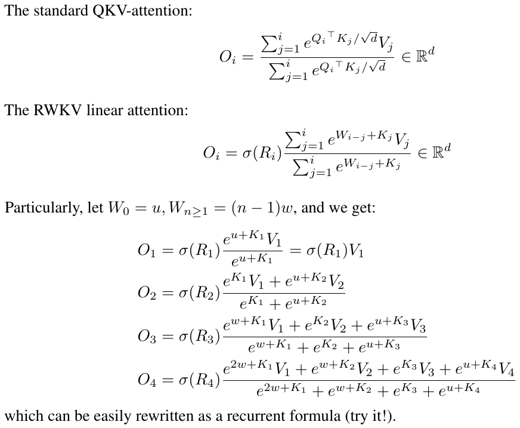
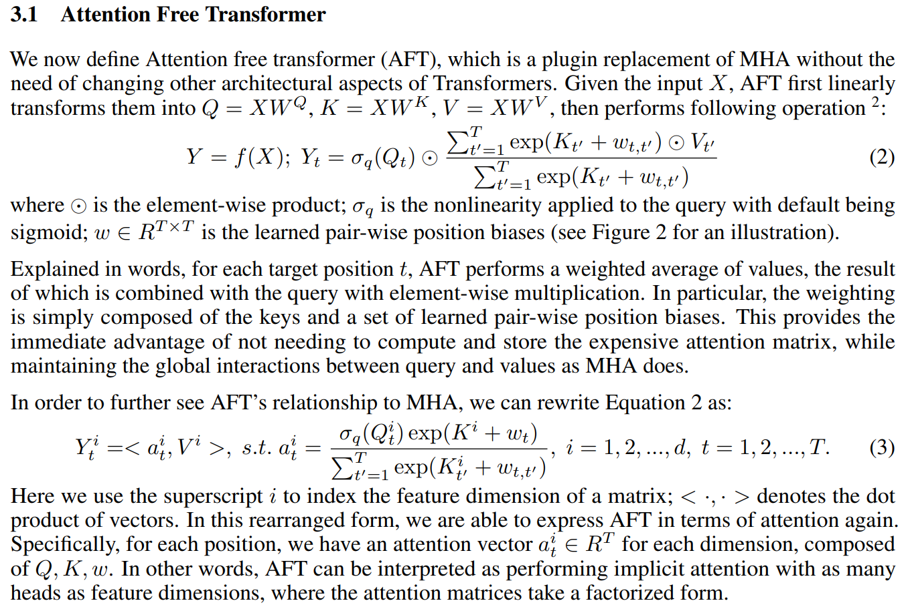

# RWKV: Receptance Weighted Key-Value (phát triển từ aft)
> RWKV là tên 4 tham số quan trọng nhất của mô hình

__receptance__: This is a technical term in structural engineering. All I can find (and grasp!) is that it is the amount of displacement per unit of force applied. This is used to determine how much a building or some structure will vibrate and move, as in an earthquake. => __sự rung lắc trên từng đơn vị lực tác động__.

__weighted__: có nghĩa là weighted sum avg của values. Còn có ý nghĩa khác? Vì w còn là tên của tham số đại diện cho "time decay curves" riêng biệt cho từng channel (nó giống một chút với ALiBi pose có thể được huấn luyện),

__Key-Value__: trong Q,K,V của self-attn

__BlinkDL__: RWKV is like AFT with special w_{k, k'}

Được cải tiến từ attention free transformer - một linear tfm nên rwkv thừa hưởng những tính chất của transformers như huấn luyện song song, giữ được các đặc trưng quan trọng của self-attention mà số lượng tham số ít hơn và độ phức tạp O(n) thay vì O(n^2).

Điểm hay của rwkv là sau vài tháng mày mò cải tiến công thức của aft (rwkv 1.0), tác giả BlinkDL (Peng Bo) nhận ra rằng công thức của rwkv có thể được viết dưới dạng hồi quy khi đơn giản hóa nó đi một chút, nên nó chính là RNN.

Có thể hiểu rằng có hai mô hình rwkv trong một bộ tham số (dùng chung một bộ tham số). Như vậy ta có thể huấn luyện hay inference rwkv như là tfm hoặc rnn. Tức là thừa hưởng độ hiệu quả khi huấn luyện của tfm (huấn luyện song song) và cũng thừa hưởng độ hiệu quả của rnn khi inference (chỉ có phép nhân vector với ma trận, ctx len là vô tận và free sentence embedding ở hidden state cuối). Nó cũng có long-term memory (thậm chí còn mạnh hơn nhiều so với LSTM).

Điểm khác biệt nổi bật của rwkv không phải là tính chất vừa là tfm vừa là rnn mà là ở độ hiệu quả khi được triển khai như là một mô hình ngôn ngữ lớn (huấn luyện từ vài trăm M tới vài trăm B params với dataset the Pile). BlinkDL đã nói có nhiều mô hình vừa là tfm vừa là rnn, nhưng chưa mô hình nào được thử nghiệm với dữ liệu đủ lớn để chứng minh tính hiệu quả (BlinkDL nói những mô hình chưa được thử nghiệm với dataset đủ lớn và những bài tests LLM chuẩn thì là soulless).

rwkv đã trải qua những thử nghiệm đó và chứng minh tính hiệu quả với một đường loss giảm giảm dần rất trơn tru (do Beng Po áp dụng nhiều mẹo và cũng do tính chất rnn của mô hình), và hiệu năng (độ chính xác) của mô hình tương đương với các transformers cùng số lượng tham số. Việc huấn luyện cũng nhanh và trơn tru hơn tfm (without loss spike at all). Và cũng tốt hơn với lượng dữ liệu nhỏ hay nói cách khác là không đòi hỏi lượng dữ liệu huấn luyện lớn để đạt được hiệu quả (well it's convering faster so that's like "do better with less data" - Beng Po). Beng Po cũng tin rằng rwkv "scaling" tốt hơn tfm !!!

Và với sự kết hợp giữa tfm và rnn này, ta có thể train rwkv với ctx len nhỏ 1024 và fine-tune nó với ctx len dài hơn rất nhiều. Nó cũng có khả năng ngoại suy (dùng với ctx len dài hơn ctx len lúc train) ngay cả khi chưa được fine-tune (TODO: cần tìm hiểu kỹ hơn tại sao lại làm được như thế)

rwkv cũng có mối liên hệ với state space models, điển hình là bài báo về H3 và FlashConv của Trí Đào vừa ra mắt. Tuy nhiên H3 không loại bỏ hoàn toàn self-attn mà giữ lại 2 tầng SA. Beng Po cũng chỉ ra rằng H3 hoạt động kém hơn rwkv, nhưng nếu H3 áp dụng toàn bộ các mẹo của rwkv thì sẽ đạt được hiệu quả tương đương. Trí Đào là tác giả của FlashAttn, và những điểm hấp dẫn nhất của FlashAttn cũng như FlashConv là cách các tác giả triển khai thuật toán của họ tối ưu nhất cho CUDA, nhiều khả năng ta cũng có thể áp dụng cách triển khai tối ưu tương tự cho rwkv (TODO: tìm cách tối ưu hóa hết mức có thể cho CUDA rwkv).

- -

https://www.reddit.com/r/MachineLearning/comments/umq908/r_rwkvv2rnn_a_parallelizable_rnn_with

Cũng có nghi ngại rằng, rwkv hay atf không thể mạnh mẽ như self-attn, điều này là đúng về mặt lý thuyết, nhưng trên thực tế vì self-attn quá mạnh mẽ nên có giả thiết cho rằng nó làm cho bộ optimizer bị confuse, và không sử dụng hết được sức mạnh của self-attn (has a low rank, etc.). Một giả thiết nữa là tính năng của tfm nằm ở FFN (as a key-value storage) once you have a reasonable self-attn like mechanism (khi bạn có một cơ chế giống như self-attn đủ hợp lý), đó là lý do tại sao MoE (mixture of experts) hoạt động rất tốt. Một tham số thêm vào của rwkv nằm ở FNN too (an extra R gate).

- -

https://www.lesswrong.com/posts/K4urTDkBbtNuLivJx/why-i-think-strong-general-ai-is-coming-soon

Cũng cần nói thêm rằng, tfm không phải là một kiến trúc quá đặc biệt. Sự thống trị của nó nằm ở việc nó ra đời đúng thời điểm, 