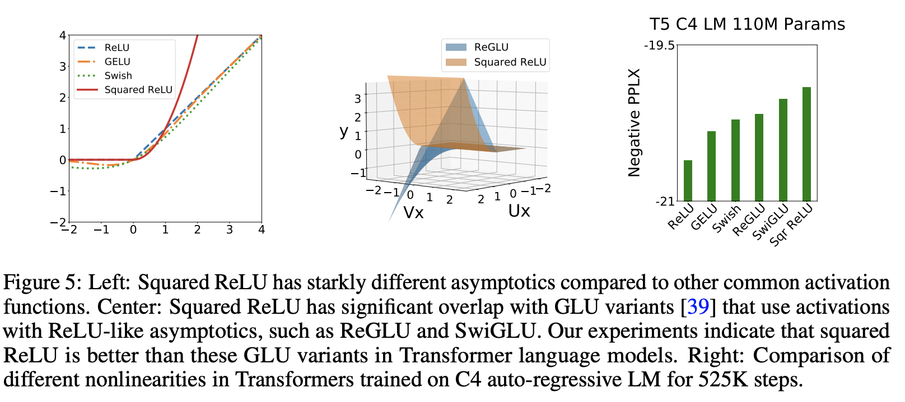

# Squared ReLU
https://paperswithcode.com/method/squared-relu

Introduced by So et al. in Primer: Searching for Efficient Transformers for Language Modeling
https://arxiv.org/pdf/2109.08668v2.pdf
 
Squared ReLU is an activation function used in the Primer architecture in the feedforward block of the Transformer layer. It is simply squared ReLU activations.

The effectiveness of higher order polynomials can also be observed in other effective Transformer nonlinearities, such as GLU variants like ReGLU and point-wise activations like approximate GELU. However, squared ReLU has drastically different asymptotics as  compared to the most commonly used activation functions: ReLU, GELU and Swish. Squared ReLU does have significant overlap with ReGLU and in fact is equivalent when ReGLU’s  and  weight matrices are the same and squared ReLU is immediately preceded by a linear transformation with weight matrix . This leads the authors to believe that squared ReLUs capture the benefits of these GLU variants, while being simpler, without additional parameters, and delivering better quality.

